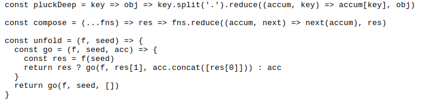

# Veoir Coursework

By Bailey Matthews (2020)

## Table of Contents

- [Veoir Coursework](#veoir-coursework)
  - [Table of Contents](#table-of-contents)
  - [3.1 Analysis of the problem](#31-analysis-of-the-problem)
    - [3.1.1 Problem identification](#311-problem-identification)
    - [3.1.2 Stakeholders](#312-stakeholders)
    - [3.1.3 Research the problem](#313-research-the-problem)
      - [Language](#language)
      - [External Language Packages](#external-language-packages)
      - [Curated Image](#curated-image)
      - [Carbon](#carbon)
      - [User-Agent](#user-agent)
      - [Cross Platform](#cross-platform)
      - [Limitations](#limitations)
    - [3.1.4 Specify the proposed solution](#314-specify-the-proposed-solution)
      - [Project Specification](#project-specification)
      - [Software Needed (Development)](#software-needed-development)
      - [Hardware Needed (Development)](#hardware-needed-development)
      - [Software Requirements (User)](#software-requirements-user)
      - [Hardware Requirements (User)](#hardware-requirements-user)
      - [Success Criteria](#success-criteria)
  - [3.2 Design of the solution](#32-design-of-the-solution)
    - [3.2.1 Decompose the problem](#321-decompose-the-problem)
    - [3.2.2 Describe the solution](#322-describe-the-solution)
    - [3.2.3 Describe the approach to testing](#323-describe-the-approach-to-testing)
  - [3.3 Developing the solution](#33-developing-the-solution)
    - [3.3.1 Iterative development process](#331-iterative-development-process)
    - [3.3.2 Testing to inform development](#332-testing-to-inform-development)
  - [3.4 Evaluation](#34-evaluation)
    - [3.4.1 Testing to inform evaluation](#341-testing-to-inform-evaluation)
    - [3.4.2 Success of the solution](#342-success-of-the-solution)
    - [3.4.3 Describe the final product](#343-describe-the-final-product)
    - [3.4.4 Maintenance and development](#344-maintenance-and-development)
  - [Footnotes](#footnotes)

## 3.1 Analysis of the problem

> **To do:**
>
> - [x] Described and justified the features that make the problem solvable by computational methods, explaining why it is amenable to a computational approach.
> - [x] Identified suitable stakeholders for the project and described them explaining how they will make use of the proposed solution and why it is appropriate to their needs.
> - [ ] Researched the problem in depth looking at existing solutions to similar problems, identifying and justifying suitable approaches based on this research.
> - [ ] Identified the essential features of the proposed computational solution explaining these choices.
> - [ ] Identified and explained with justification any limitations of the proposed solution.
> - [ ] Specified and justified the requirements for the solution including (as appropriate) any hardware and software requirements.
> - [ ] Identified and justified measurable success criteria for the proposed solution.

> **Notes:**
>
> - A brief, succinct description of your project, what you will do
> - Explain why the project needs to be completed by a computer
> - **Research** – lots of research (all poor projects fail here) – this is where you go and find out HOW TO DO YOUR PROJECT!! I cannot emphasise this enough. In this section you'll need to find out how other people have - solved similar problems and use this to justify your approach.
> - Success criteria
> - Hardware and software requirements
> - Testing strategy this makes it really

### 3.1.1 Problem identification

> **To do:**
>
> - [x] Describe and justify the features that make the problem solvable by computational methods.
> - [x] Explain why the problem is amenable to a computational approach.

My project aims to turn screenshots of code that are normally shared online amongst developers into a more appealing, editable and customizable image. I'm also aiming to combat the limitation of being unable to copy and paste code from images by creating a unique URL design system to help increase usability and accessibility. The problem is that the screenshots of images are often unappealing and create an atmosphere around programming that it's too confusing. The image below is an example of the image I am trying to fix:

As you can see this is difficult to read and has no padding around the edges. Therefore, when uploading to social media, such as Twitter, the image is cut and the code is hidden. This is not a major problem, but as the aim of my project is to make it look appealing to new and existing developers, I would like to try and amend this issue.

There are several factors that make this problem suitable for being solved with a computational approach. The main factor is image manipulation, a computer is far better at performing image manipulation effectively and quickly. Other factors are time taken to complete the task, reproducibility, standardisation and, simply, ease of use. I'll explain what I mean by these a little more. When working in a productive manor, or on a tight time-scale, a user would not want to have to load up their image manipulation program, screenshot their code, edit their image and then decide what colors they want where. They would then have to repeat this process every time they want to share a piece code. As image manipulation program's require vast amounts of user input, the outcome will always be slightly different due to user error. Solving a problem computationally removes this user error and allows for a stable system that, when an identical input is given, an identical output is returned.

The structure of my project, being an API, means that object-oriented programming will be suitable. This is largely given to the event-driven architecture an API possesses, but also allows a key goal of standardisation to be achieved. In addition, inheritance and polymorphism are more computational methods that can be used in order to build on top of the base class for an input by allowing different themes to be selected and different outputs such as different file formats that may require specialised properties and functions. These methods will allow me to follow a modular approach when developing my project and will aid development of new features as well as improve readability.

### 3.1.2 Stakeholders

> **To do:**
>
> - [x] Identify and describe those who will have an interest in the solution explaining how the solution is appropriate to their needs (this may be named individuals, groups or persona that describes the target end user).

In my opinion, the main stakeholders for my project will be general developers, but more inclined to those who write tutorials and have a large social-media influence, where writing and showing appealing content is important to them and their audience. I also feel that it would have a positive impact on people writing documentation or including small examples of how their project can be used.

Along with developers, my project could have an educational value as students could use this to create images of their code which wil be easier to hand in to their teacher. Also, the teacher could use my project to show example snippets, such as explaining recursion, and perhaps print the images, allowing for a "quick guide" worksheet to help the students along with a task.

As I also plan to include a way to use a link to gain access to an editable and copyable page, similar to how the GitHub service "GitHub Gists"[1](#f1) works, only with a simpler and more intuitive user interface with the ability for the user to re-share their edited code. This creates a nice workflow that anyone would be able to use for multiple purposes, such as listing bash commands that are needed to install content or asking for a review on a small text paragraph which may needed to be updated from time-to-time.

Due to the image being permanently kept, this would appeal to blog writers as they don't have to store the image on their own webserver and can simply include the image link. This ecosystem would allow creators to evolve their tutorials and social media outreach using one service and without having to learn a photo editing program with peace of mind their content won't be affected.

### 3.1.3 Research the problem

> **To do:**
>
> - [x] Research the problem and solutions to similar problems to identify and justify suitable approaches to a solution.
> - [ ] **(?)** Describe the essential features of a computational solution explaining these choices.
> - [x] Explain the limitations of the proposed solution.

When researching how to build my project, the most important decision to be made is what programming language I would choose. This is because an API can be built in many languages, but I need one that can specifically handle image manipulation well and perform quickly and safely while also being robust and well tested. Other things to consider and cross-platform capabilities and the development life-cycle: I don't want a language that is easy to maintain but requires lots of effort to find and fix a bug, or one that requires specialised solutions when deploying to cloud services.

#### Language

For my project, I will be using Go[2](#f2) as this is a strongly typed language. This helps maintain a clear structure as, for example, we can assign variables to a type and they can contain only that type, attempting to assign this variable to another type fails at compile-time. This ensures that no type errors occur during run-time, other than within edge cases. Go also allows us to define fields and methods in `structs`[3](#f3) and `interfaces`[4](#f4) which are easily compatible with JSON when using the `encoding/json`[5](#f5) and `net/http`[6](#f6) packages. This will be very helpful when developing the API as Go has very useful core packages to help create an HTTP server that can receive requests. There are however a few changes to the default `net/http`[6](#f6) package that need to be changed in order for my Go program to become 'production ready' and correctly handle a large number of requests. This is discussed in detail within section [3.2](#32-design-of-the-solution).

Other advantages of Go is that it offers a growing community of support and due to the language being openly developed and used by Google since it first appeared in November 2009, there is an abundance of questions relating to specific topics on forums or question asking sites such as StackOverflow. Go also offers memory safety[x](#fx), garbage collection[x](#fx) and concurrency[x](#fx) which are extremely useful when developing in said language as it ensures that there are lower chances for memory leaks and if the program is written correctly the garbage collection will ensure that a lower amount of memory is used. This lowers cost for hardware and is a very practical solution.

Built in testing is also another factor which I find a huge benefit within Go as it ensures that all code can be easily tested, but eliminates the complicated setup of integrating a third-party testing service into the development life-cycle. Finally, auto-generated technical documentation for all packages created in Go on their website allows for not only my program to be well documented but for all packages I import and use to be well documented.

Other languages I considered where Python[x](#fx), PHP[x](#fx) and JavaScript[x](#fx) (using the V8 JavaScript engine[x](#fx) within NodeJS[x](#fx)). I know Python very well and it has a large support community as well as good documentation however the increased use of whitespace highlights a development issues as it becomes increasingly hard to debug an issue on larger files when whitespace is the only way to change the runtime hierarchy of the code. It is in my personal opinion that I think the whitespace removes readability rather than increases it. Another factor of Python is that it is mainly a loosely typed and interpreted language at runtime, and to ensure it is compiled it requires further steps within the development cycle that are just not needed within Go.

PHP is another alternative that I considered, it has a large developer following, it is much more mature than Go, as it was created in 1994, and it has an abundance of frameworks to ensure that API development is easy. Another plus is that PHP can be used for the whole development stack: frontend and backend, without much extra work. The big negative is that is an interpreted language, which means I can not use the compiler to check if I have made any 'silly' errors, such as a misplacement of a variable until the code is run within the program. To combat this I could use tests but PHP requires a large amount of work to use tests, and to ensure good testing I would be forced to reply upon existing frameworks which may reach end-of-life due to the thrid-party nature of such applications.

Lastly, I considered JavaScript to be another good alternative as with NodeJS (Or more recently Deno[x](#fx)) it allows for easy server-side development and frontend development in one codebase. However, I find that I would need to use a language like Typescript[x](#fx) to ensure that my JavaScript code was strictly typed. This would add further complication to the development life-cycle and require the knowledge of a separate language (TypeScript) to code my project. The reason I would not use JavaScript on its own is the lack of structure I feel the types have. For example:

- `[]` and `![]` are both equal. Further more, `!![]` returns `true` meaning that removing the contradicting double exclamation mark, 'not not' should mean that `[]` still equals `true`, but it in-fact equals `false`
- `NaN` which stands for 'Not a Number', is in-fact interpreted as a number.

These are just two examples but I feel that it would increase the time spent trying to debug errors that logically make sense and should work, but do to the nature of JavaScripts type matching fail.

#### External Language Packages

Although Go has a vast number of core packages, including a `net/http`[6](#f6) package for handling requests over the http protocol, there are also a vast number of user created packages that extend the default packages. For my project, I will be using Julien Schmidt's[7](#f7) `HttpRouter`[8](#f8) library that is still low level, therefor quick, but adds important features such as a built-in routing pattern that allows for HTTP paths to be easily created and improves readability within the code.

There are a few other packages that I could have picked, such as Resty[x](#fx), go-http-client[x](#fx) and Gentleman[x](#fx). The reasons for not picking Resty and Gentleman are they they are more of a separate package meant to overlay the core `net/http` package that Go provides. I do not want this as it adds unnecessary complication to my application but also increases the development risk of such a package becoming unmaintained and therefor requiring more time in the future. The reason I chose HttpRouter over go-http-client is that go-http-client is a relatively new package with a single maintainer. This means it could change quickly and abruptly due to the discretion of the maintainer and break my application. The singe maintainer could also lose interest and abandon the package. Requiring me to move to a new one anyway. There is also no overwhelming differences or features that go-http-client has and HttpRouter doesn't. Therefor I decided to go with the safer option.

#### Curated Image

Once a user has sent data to my service, I want to be able to send back an image encoding of their choice, from the select options, such as PNG, SVG and GIF. To do this, and to make image designs (such as colors) the same on each exported type, I will need to use a base image. For this, I am using an SVG, as it's the easiest to create and maintain from a developer's perspective when creating either standard layouts or a master template as an SVG is an XML-based[9](#f9) vector image. This means it can be written as text and then interpreted by the browser (or other software) to output a graphic. SVGs also allow for inline CSS[10](#f10) which will allow for a themeable environment. Such environment will increase the production value of my project as users will be able to create and use colours related to their product or website etc.

For converting the image from an SVG to other encodings I will require an external package. I have done some research and feel that Discord's Go image manipulation package will be sufficient for my needs when encoding an SVG to other codecs.
> Improve this section with further research

#### Carbon

Carbon[11](#f11) is a very similar project to what I want to achieve. However, they focused on a website-first design which means that they don't have a public API which other users can implement onto their own apps, they have to instead use the website. This creates more work for the creator of a blog etc. and limits the pluggability of such a service into other projects created by 3rd party developers. There are however a few community[12](#f12) projects that aim to implement Carbon[11](#f11) into other text editors and a CLI (Command Line Interface), and I would welcome these ideas into my project.

#### User-Agent

A user-agent is a string that is sent from every browser with each request. It can be used to ensure that the sent data is rendered correctly for each browser engine. I plan to use this feature to test whether the HTTP request for the image is being sent from a browser, or another resource. To do this I will match the sent user-agent against an array of 'known' user-agents for the most used browsers[x](#fx). The reason I want to check whether a request is sent from a browser is to change the request to include HTML code for my code-editing form. This obviously can't be included when the image is fetched from another source as it would be expecting an image header and an image file to be sent directly. This may cause some confusion for users if they use options like 'open image in new tab'. To counteract this, I will add an option to append to the URL to directly get the image.

This will mean that I will have the URLs built as:

- `/<hash>.png`: This will be the default path which would include a check to see if it was from a browser.
- If a user is visiting from a browser they will be redirected to `/<hash>/` which is where they will be greeted with the editor.
- If a user requires the image to be served with the image headers and direct file while using the browser they will be able to use `/raw/<hash>.png`. This will direct to `/<hash>.png?r=1` where `r` will relate to a variable 'raw' and `1` will mean true. Alright I could send the user directly to the URL with the parameter I want to be able to create a memorable path.

> Use the user-agent to either display the editor or the raw encoding of the image, talk about how I can find the ones relating to all major browsers.

#### Cross Platform

Due to the design of Go[2](#f2) and the powerful CLI options, the source-code can be built to run on most architectures, and all well-known ones such as Darwin[13](#f13) (MacOS / iOS[14](#f14)), Linux[15](#f15), Windows[16](#f16) and FreeBSD[17](#f17). Sometimes there is a needed addition of a C compiler for architectures such as Android[18](#f18). It even supports WASM[19](#f19) which allows for Go to be compiled and supported on a browser.

> Explain why cross platform will allow me to deploy it on a server of my chosing easier and cheaply

#### Limitations

As far a Go[2](#f2) goes there are very few technical limitations. However, as a project there are a few limitations surrounding the development life-cycle and 'real-world' usage. 

These are things such as including rate-limiting[20](#f20) and authorisation[21](#f21) over a public endpoint to reduce server load and prevent DDoS attacks[22](#f22) from overloading the server due to image processing tasks which are resource intensive.

Due to the time constrain of the given period to complete this task, I will not be including these factors as they will require a database to be setup, a database handler to be implemented and a user service that would handle sign-ups and token generations. I feel these would deviate to far from the core of the project and in turn I have decided to design the program in such a way that a database could be implemented at a later date and support these factors, but the current endpoint for the project will be created without any security features protecting it from attacks as it will only be used in a contained and controlled environment.

### 3.1.4 Specify the proposed solution

> **To do:**
>
> - [ ] Specify and justify the solution requirements including hardware and software configuration (if appropriate).
> - [ ] Identify and justify measurable success criteria for the proposed solution.

#### Project Specification

A REST API[23](#f23) web server with the ability to receive a payload, use said values and options sent to create and return an image containing the code in a timely manor with support for styling and encoding options.

The ability to recognise when an image is being accessed by a browser using the user-agent[24](#f24) to either serve a HTML page containing an editor or the raw encoding of an image when it is being accessed by a server which expects an image type to be found.

#### Software Needed (Development)

- Go[2](#f2).
- A text editor.
- Any supported OS of both Go[2](#f2) and a text editor.

#### Hardware Needed (Development)

- A computer with at minimum a keyboard, monitor and adhering to the minimum hardware requirements[25](#f25) of Go.

#### Software Requirements (User)

- Any system capable of using cURL[26](#f26) or alternatives.

#### Hardware Requirements (User)

- A computer with at minimum a keyboard, monitor and an active internet connection to access the API.

#### Success Criteria

> Todo

## 3.2 Design of the solution

> **To do:**
>
> - [ ] Broken the problem down systematically into a series of smaller problems suitable for computational solutions, explaining and justifying the process.
> - [ ] Defined in detail the structure of the solution to be developed.
> - [ ] Described the solution fully using appropriate and accurate algorithms justifying how these algorithms form a complete solution to the problem.
> - [ ] Described, justifying choices made, the usability features to be included in the solution.
> - [ ] Identified and justified the key variables / data structures / classes (as appropriate to the proposed solution) justifying and explaining any necessary validation.
> - [ ] Identified and justified the test data to be used during the iterative development of the solution.
> - [ ] Identified and justified any further data to be used in the post development phase.

> **Notes:**
>
> - As it says on the tin – design your project. The key here is CODE, CODE, CODE.
> - You CANNOT get any more than 4 marks in this section unless you have designed the CODE for ALL parts of your project. Again, most projects that do badly will have failed here.
> - Screen designs, code designs, diagrams, tables of key variables and data structures

> The default ListenAndServe method uses the default HTTP server. Some of the default values are set to extremely long values or are set to 0 (which disables them). Cloudflare has written an extensive blog post on how to set up a production-ready Go HTTP server and HTTP client. https://blog.cloudflare.com/the-complete-guide-to-golang-net-http-timeouts/
> 
### 3.2.1 Decompose the problem

> **To do:**
>
> - [ ] Break down the problem into smaller parts suitable for computational solutions justifying any decisions made.

### 3.2.2 Describe the solution

> **To do:**
>
> - [ ] Explain and justify the structure of the solution.
> - [ ] Describe the parts of the solution using algorithms justifying how these algorithms form a complete solution to the problem.
> - [ ] Describe usability features to be included in the solution.
> - [ ] Identify key variables / data structures / classes justifying choices and any necessary validation.

### 3.2.3 Describe the approach to testing

> **To do:**
>
> - [ ] Identify the test data to be used during the iterative development and post development phases and justify the choice of this test data.

## 3.3 Developing the solution

> **To do:**
>
> - [ ] Provided evidence of each stage of the iterative development process for a coded solution relating this to the break down of the problem from the analysis stage and explaining what they did and justifying why.
> - [ ] Provided evidence of prototype versions of their solution for each stage of the process.
> - [ ] The solution will be well structured and modular in nature.
> - [ ] Code will be annotated to aid future maintenance of the system.
> - [ ] All variables and structures will be appropriately named.
> - [ ] There will be evidence of validation for all key elements of the solution.
> - [ ] The development will show review at all key stages in the process.

> **Notes:**
>
> - Talk through the development of your program
> - Show you have systematically tested the code you have written as you go along
> - Do not hide mistakes, talk about them

### 3.3.1 Iterative development process

> **To do:**
>
> - [ ] Provide annotated evidence of each stage of the iterative development process justifying any decision made.
> - [ ] Provide annotated evidence of prototype solutions justifying any decision made.

### 3.3.2 Testing to inform development

> **To do:**
>
> - [ ] Provide annotated evidence for testing at each stage justifying the reason for the test.
> - [ ] Provide annotated evidence of any remedial actions taken justifying the decision made.

> **Notes:**
>
> - Final, terminal testing to prove you've met the success criteria and objectives you identified in the analysis stage

## 3.4 Evaluation

> **To do:**
>
> - [ ] Provided annotated evidence of post development testing for function and robustness.
> - [ ] Provided annotated evidence for usability testing. Used the test evidence to cross reference with the success criteria to evaluate the solution explain how the evidence shows that the criteria has been fully, partially or not met in each case.
> - [ ] Provided comments on how any partially or unmet criteria could be addressed in further development.
> - [ ] Provided evidence of the usability features justifying their success, partial success or failure as effective usability features.
> - [ ] Provided comments on how any issues with partially or unmet usability features could be addressed in further development.
> - [ ] Considered maintenance issues and limitations of the solution.
> - [ ] Described how the program could be developed to deal with limitations of potential improvements / changes.
> - [ ] There is a well developed line of reasoning which is clear and logically structured. The information presented is relevant and substantiated.

> **Notes:**
>
> - As you'd expect – how well did the project go?

### 3.4.1 Testing to inform evaluation

> **To do:**
>
> - [ ] Provide annotated evidence of testing the solution of robustness at the end of the development process.
> - [ ] Provide annotated evidence of usability testing (user feedback).

### 3.4.2 Success of the solution

> **To do:**
>
> - [ ] Use the test evidence from the development and post development process to evaluate the solution against the success criteria from the analysis.

### 3.4.3 Describe the final product

> **To do:**
>
> - [ ] Provide annotated evidence of the usability features from the design, commenting on their effectiveness.

### 3.4.4 Maintenance and development

> **To do:**
>
> - [ ] Discuss the maintainability of the solution.
> - [ ] Discuss potential further development of the solution.

## Footnotes

1. A gist can be a string of code, a bash script or some other small piece of data and is an easy way to share code. GitHub (https://github.com) has a nice implementation of this in their GitHub Gist (https://gist.github.com) service. [↩](#i1)
2. Go, sometimes referred to as Golang, is a programming language made by Google. Go's website (https://golang.org) contains more information. [↩](#i2)
3. [↩](#i2)
4. [↩](#i3)
5. [↩](#i4)
6. [↩](#i5)
7. Julien Schmidt (https://github.com/julienschmidt) [↩](#i6)
8. `HttpRouter` (https://github.com/julienschmidt/httprouter) [↩](#i7)
9. [↩](#i5)
10. [↩](#i5)
11. Carbon's Website (https://carbon.now.sh/) [↩](#i5)
12. Carbon's Github Readme (https://github.com/carbon-app/carbon#community) [↩](#i5)
13. [↩](#i5)
14. [↩](#i5)
15. [↩](#i5)
16. [↩](#i5)
17. [↩](#i5)
18. [↩](#i5)
19. [↩](#i5)
20. [↩](#i5)
21. [↩](#i5)
22. [↩](#i5)
23. [↩](#i5)
24. [↩](#i5)
25.  Minimum Requirements of Go (https://github.com/golang/go/wiki/MinimumRequirements) [↩](#i25)