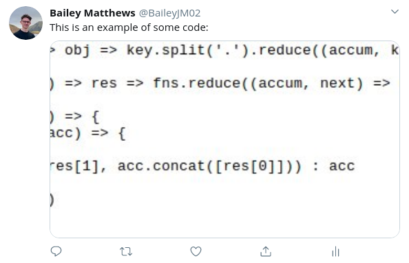

# Veoir Coursework <!-- omit in toc -->

By Bailey Matthews (2020)

## Table of Contents <!-- omit in toc -->

- [3.1 Analysis of the problem](#31-analysis-of-the-problem)
  - [3.1.1 Problem identification](#311-problem-identification)
  - [3.1.2 Stakeholders](#312-stakeholders)
  - [3.1.3 Research the problem](#313-research-the-problem)
  - [3.1.4 Specify the proposed solution](#314-specify-the-proposed-solution)
- [3.2 Design of the solution](#32-design-of-the-solution)
  - [3.2.1 Decompose the problem](#321-decompose-the-problem)
  - [3.2.2 Describe the solution](#322-describe-the-solution)
  - [3.2.3 Describe the approach to testing](#323-describe-the-approach-to-testing)
- [3.3 Developing the solution](#33-developing-the-solution)
  - [3.3.1 Iterative development process](#331-iterative-development-process)
  - [3.3.2 Testing to inform development](#332-testing-to-inform-development)
- [3.4 Evaluation](#34-evaluation)
  - [3.4.1 Testing to inform evaluation](#341-testing-to-inform-evaluation)
  - [3.4.2 Success of the solution](#342-success-of-the-solution)
  - [3.4.3 Describe the final product](#343-describe-the-final-product)
  - [3.4.4 Maintenance and development](#344-maintenance-and-development)
- [Footnotes](#footnotes)

## 3.1 Analysis of the problem

> **To do:**
>
> - [x] Described and justified the features that make the problem solvable by computational methods, explaining why it is amenable to a computational approach.
> - [x] Identified suitable stakeholders for the project and described them explaining how they will make use of the proposed solution and why it is appropriate to their needs.
> - [ ] Researched the problem in depth looking at existing solutions to similar problems, identifying and justifying suitable approaches based on this research.
> - [ ] Identified the essential features of the proposed computational solution explaining these choices.
> - [ ] Identified and explained with justification any limitations of the proposed solution.
> - [ ] Specified and justified the requirements for the solution including (as appropriate) any hardware and software requirements.
> - [ ] Identified and justified measurable success criteria for the proposed solution.

> **Notes:**
>
> - A brief, succinct description of your project, what you will do
> - Explain why the project needs to be completed by a computer
> - **Research** – lots of research (all poor projects fail here) – this is where you go and find out HOW TO DO YOUR PROJECT!! I cannot emphasise this enough. In this section you'll need to find out how other people have - solved similar problems and use this to justify your approach.
> - Success criteria
> - Hardware and software requirements
> - Testing strategy this makes it really

### 3.1.1 Problem identification

> **To do:**
>
> - [x] Describe and justify the features that make the problem solvable by computational methods.
> - [x] Explain why the problem is amenable to a computational approach.

My project aims to turn screenshots of code that are normally shared online amongst developers into a more appealing, editable and customizable image. I'm also aiming to combat the limitation of being unable to copy and paste code from images by creating a unique URL design system to help increase usability and accessibility. The problem is that the screenshots of images are often unappealing and create an atmosphere around programming that it's too confusing. The image below is an example of the image I am trying to fix:

As you can see this is difficult to read and has no padding around the edges. Therefore, when uploading to social media, such as Twitter, the image is cut and the code is hidden. This is not a major problem, but as the aim of my project is to make it look appealing to new and existing developers, I would like to try and amend this issue.

There are several factors that make this problem suitable for being solved with a computational approach. The main factor is image manipulation, a computer is far better at performing image manipulation effectively and quickly. Other factors are time taken to complete the task, reproducibility, standardisation and, simply, ease of use. I'll explain what I mean by these a little more. When working in a productive manor, or on a tight time-scale, a user would not want to have to load up their image manipulation program, screenshot their code, edit their image and then decide what colors they want where. They would then have to repeat this process every time they want to share a piece code. As image manipulation program's require vast amounts of user input, the outcome will always be slightly different due to user error. Solving a problem computationally removes this user error and allows for a stable system that, when an identical input is given, an identical output is returned.

The structure of my project, being an API, means that object-oriented programming will be suitable. This is largely given to the event-driven architecture an API possesses, but also allows a key goal of standardisation to be achieved. In addition, inheritance and polymorphism are more computational methods that can be used in order to build on top of the base class for an input by allowing different themes to be selected and different outputs such as different file formats that may require specialised properties and functions. These methods will allow me to follow a modular approach when developing my project and will aid development of new features as well as improve readability.

### 3.1.2 Stakeholders

> **To do:**
>
> - [x] Identify and describe those who will have an interest in the solution explaining how the solution is appropriate to their needs (this may be named individuals, groups or persona that describes the target end user).

In my opinion, the main stakeholders for my project will be general developers, but more inclined to those who write tutorials and have a large social-media influence, where writing and showing appealing content is important to them and their audience. I also feel that it would have a positive impact on people writing documentation or including small examples of how their project can be used.

Along with developers, my project could have an educational value as students could use this to create images of their code which wil be easier to hand in to their teacher. Also, the teacher could use my project to show example snippets, such as explaining recursion, and perhaps print the images, allowing for a "quick guide" worksheet to help the students along with a task.

### 3.1.3 Research the problem

> **To do:**
>
> - [ ] Research the problem and solutions to similar problems to identify and justify suitable approaches to a solution.
> - [ ] Describe the essential features of a computational solution explaining these choices.
> - [ ] Explain the limitations of the proposed solution.

For my project, I will be using Go[1](#f1) as this is a strongly typed language. This helps maintain a clear structure as variable types can't be more than one. Go also allows us to define fields and methods in `structs`[2](#f2) and `interfaces`[3](#f3) which are easily compatible with JSON when using the `encoding/json`[4](#f4) and `net/http`[5](#f5) packages. This will be very helpful when developing the API as Go has very useful core packages to help create an HTTP server that can receive requests. 

### 3.1.4 Specify the proposed solution

> **To do:**
>
> - [ ] Specify and justify the solution requirements including hardware and software configuration (if appropriate).
> - [ ] Identify and justify measurable success criteria for the proposed solution.

## 3.2 Design of the solution

> **To do:**
>
> - [ ] Broken the problem down systematically into a series of smaller problems suitable for computational solutions, explaining and justifying the process.
> - [ ] Defined in detail the structure of the solution to be developed.
> - [ ] Described the solution fully using appropriate and accurate algorithms justifying how these algorithms form a complete solution to the problem.
> - [ ] Described, justifying choices made, the usability features to be included in the solution.
> - [ ] Identified and justified the key variables / data structures / classes (as appropriate to the proposed solution) justifying and explaining any necessary validation.
> - [ ] Identified and justified the test data to be used during the iterative development of the solution.
> - [ ] Identified and justified any further data to be used in the post development phase.

> **Notes:**
>
> - As it says on the tin – design your project. The key here is CODE, CODE, CODE.
> - You CANNOT get any more than 4 marks in this section unless you have designed the CODE for ALL parts of your project. Again, most projects that do badly will have failed here.
> - Screen designs, code designs, diagrams, tables of key variables and data structures

### 3.2.1 Decompose the problem

> **To do:**
>
> - [ ] Break down the problem into smaller parts suitable for computational solutions justifying any decisions made.

### 3.2.2 Describe the solution

> **To do:**
>
> - [ ] Explain and justify the structure of the solution.
> - [ ] Describe the parts of the solution using algorithms justifying how these algorithms form a complete solution to the problem.
> - [ ] Describe usability features to be included in the solution.
> - [ ] Identify key variables / data structures / classes justifying choices and any necessary validation.

### 3.2.3 Describe the approach to testing

> **To do:**
>
> - [ ] Identify the test data to be used during the iterative development and post development phases and justify the choice of this test data.

## 3.3 Developing the solution

> **To do:**
>
> - [ ] Provided evidence of each stage of the iterative development process for a coded solution relating this to the break down of the problem from the analysis stage and explaining what they did and justifying why.
> - [ ] Provided evidence of prototype versions of their solution for each stage of the process.
> - [ ] The solution will be well structured and modular in nature.
> - [ ] Code will be annotated to aid future maintenance of the system.
> - [ ] All variables and structures will be appropriately named.
> - [ ] There will be evidence of validation for all key elements of the solution.
> - [ ] The development will show review at all key stages in the process.

> **Notes:**
>
> - Talk through the development of your program
> - Show you have systematically tested the code you have written as you go along
> - Do not hide mistakes, talk about them

### 3.3.1 Iterative development process

> **To do:**
>
> - [ ] Provide annotated evidence of each stage of the iterative development process justifying any decision made.
> - [ ] Provide annotated evidence of prototype solutions justifying any decision made.

### 3.3.2 Testing to inform development

> **To do:**
>
> - [ ] Provide annotated evidence for testing at each stage justifying the reason for the test.
> - [ ] Provide annotated evidence of any remedial actions taken justifying the decision made.

> **Notes:**
>
> - Final, terminal testing to prove you've met the success criteria and objectives you identified in the analysis stage

## 3.4 Evaluation

> **To do:**
>
> - [ ] Provided annotated evidence of post development testing for function and robustness.
> - [ ] Provided annotated evidence for usability testing. Used the test evidence to cross reference with the success criteria to evaluate the solution explain how the evidence shows that the criteria has been fully, partially or not met in each case.
> - [ ] Provided comments on how any partially or unmet criteria could be addressed in further development.
> - [ ] Provided evidence of the usability features justifying their success, partial success or failure as effective usability features.
> - [ ] Provided comments on how any issues with partially or unmet usability features could be addressed in further development.
> - [ ] Considered maintenance issues and limitations of the solution.
> - [ ] Described how the program could be developed to deal with limitations of potential improvements / changes.
> - [ ] There is a well developed line of reasoning which is clear and logically structured. The information presented is relevant and substantiated.

> **Notes:**
>
> - As you'd expect – how well did the project go?

### 3.4.1 Testing to inform evaluation

> **To do:**
>
> - [ ] Provide annotated evidence of testing the solution of robustness at the end of the development process.
> - [ ] Provide annotated evidence of usability testing (user feedback).

### 3.4.2 Success of the solution

> **To do:**
>
> - [ ] Use the test evidence from the development and post development process to evaluate the solution against the success criteria from the analysis.

### 3.4.3 Describe the final product

> **To do:**
>
> - [ ] Provide annotated evidence of the usability features from the design, commenting on their effectiveness.

### 3.4.4 Maintenance and development

> **To do:**
>
> - [ ] Discuss the maintainability of the solution.
> - [ ] Discuss potential further development of the solution.

## Footnotes

1.  Go, sometimes referred to as "Golang", is a programming language made by Google. [Golang's website](https://golang.org) contains more information. [↩](#i1)
2.  [↩](#i2)
3.  [↩](#i3)
4.  [↩](#i4)
5.  [↩](#i5)