# Veoir Coursework

By Bailey Matthews (2020)

- [Veoir Coursework](#veoir-coursework)
  - [3.1 Analysis of the problem](#31-analysis-of-the-problem)
    - [3.1.1 Problem identification](#311-problem-identification)
    - [**3.1.2** Stakeholders](#312-stakeholders)
    - [3.1.3 Research the problem](#313-research-the-problem)
      - [Language](#language)
      - [External Language Packages](#external-language-packages)
      - [Curated Image](#curated-image)
      - [Carbon](#carbon)
      - [User-Agent](#user-agent)
      - [Cross Platform](#cross-platform)
      - [Essential features of the computational solution](#essential-features-of-the-computational-solution)
      - [Limitations](#limitations)
    - [3.1.4 Specify the proposed solution](#314-specify-the-proposed-solution)
      - [Project Specification](#project-specification)
      - [Software Needed (Development)](#software-needed-development)
      - [Hardware Needed (Development)](#hardware-needed-development)
      - [Software Requirements (User)](#software-requirements-user)
      - [Hardware Requirements (User)](#hardware-requirements-user)
      - [Success Criteria](#success-criteria)
  - [3.2 Design of the solution](#32-design-of-the-solution)
    - [3.2.1 Decompose the problem](#321-decompose-the-problem)
      - [Overview](#overview)
      - [Website](#website)
      - [REST API](#rest-api)
    - [3.2.2 Describe the solution](#322-describe-the-solution)
      - [Module Hierarchy](#module-hierarchy)
      - [Engine Package](#engine-package)
      - [Engine SVG/PNG Packages](#engine-svgpng-packages)
      - [Queue Package](#queue-package)
      - [Router Package](#router-package)
      - [Catalogue Package](#catalogue-package)
      - [Types Package](#types-package)
    - [3.2.3 Describe the approach to testing](#323-describe-the-approach-to-testing)
  - [3.3 Developing the solution](#33-developing-the-solution)
    - [3.3.1 Iterative development process](#331-iterative-development-process)
      - [Setting up the project](#setting-up-the-project)
      - [Queue Package](#queue-package-1)
      - [Router Package](#router-package-1)
      - [Catalogue Package](#catalogue-package-1)
      - [Engine SVG Package](#engine-svg-package)
      - [Engine PNG Package](#engine-png-package)
    - [3.3.2 Testing to inform development](#332-testing-to-inform-development)
  - [3.4 Evaluation](#34-evaluation)
    - [3.4.1 Testing to inform evaluation](#341-testing-to-inform-evaluation)
    - [3.4.2 Success of the solution](#342-success-of-the-solution)
    - [3.4.3 Describe the final product](#343-describe-the-final-product)
    - [3.4.4 Maintenance and development](#344-maintenance-and-development)
  - [Footnotes](#footnotes)

## 3.1 Analysis of the problem

### 3.1.1 Problem identification

My project aims to turn screenshots of code that are normally shared online amongst developers into a more appealing, editable and customizable image. I'm also aiming to combat the limitation of being unable to copy and paste code from images by creating a unique URL design system to help increase usability and accessibility. The problem is that the screenshots of images are often unappealing and create an atmosphere around programming that it's too confusing. The image below is an example of the image I am trying to fix:

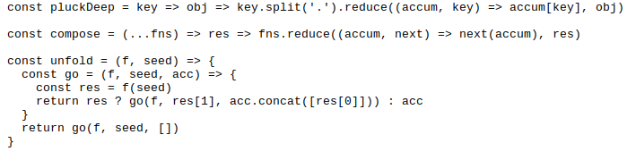

As you can see this is difficult to read and has no padding around the edges. Therefore, when uploading to social media, such as Twitter, the image is cut and the code is hidden. This is a major problem as the aim of my project is to make it look appealing to new and existing developers, therefore I would like to amend this issue.

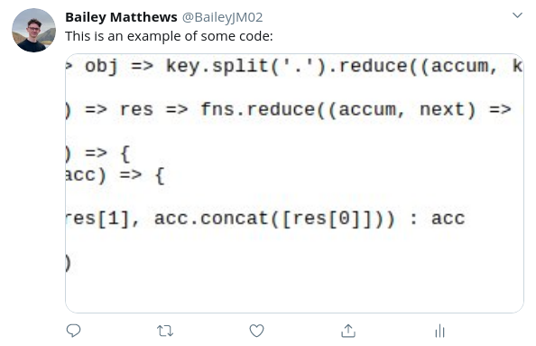

There are several factors that make this problem suitable for being solved with a computational approach. The main factor is image manipulation, a computer is far better at performing image manipulation effectively and quickly. Other factors are time taken to complete the task, reproducibility, standardisation and, simply, ease of use. I'll explain what I mean by these a little more. When working in a productive manor, or on a tight time-scale, a user would not want to have to load up their image manipulation program, screenshot their code, edit their image and then decide what colours they want where. They would then have to repeat this process every time they want to share a piece code. As image manipulation program's require vast amounts of user input, the outcome will always be slightly different due to user error. Solving a problem computationally removes this user error and allows for a stable system that, when an identical input is given, an identical output is returned.

The structure of my project, being an API, means that object-oriented programming will be suitable. This is largely given to the event-driven architecture an API possesses, but also allows a key goal of standardisation to be achieved. In addition, inheritance and polymorphism are more computational methods that can be used in order to build on top of the base class for an input by allowing different themes to be selected and different outputs such as different file formats that may require specialised properties and functions. These methods will allow me to follow a modular approach when developing my project and will aid development of new features as well as improve readability.

### **3.1.2** Stakeholders

In my opinion, the main stakeholders for my project will be general developers, but more inclined to those who write tutorials and have a large social-media influence, where writing and showing appealing content is important to them and their audience. I also feel that it would have a positive impact on people writing documentation or including small examples of how their project can be used.

Along with developers, my project could have an educational value as students could use this to create images of their code which will be easier to hand in to their teacher. Also, the teacher could use my project to show example snippets, such as explaining recursion, and perhaps print the images, allowing for a "quick guide" worksheet to help the students along with a task.

As I also plan to include a way to use a link to gain access to an editable page, similar to how the GitHub service "GitHub Gists"<sup id="i1">[1](#f1)</sup> works, only with a simpler and more intuitive user interface with the ability for the user to re-share their edited code. This creates a nice workflow that anyone would be able to use for multiple purposes, such as listing bash commands that are needed to install content or asking for a review on a small text paragraph which may needed to be updated from time-to-time.

Due to the image being permanently kept, this would appeal to blog writers as they don't have to store the image on their own webserver and can simply include the image link. This ecosystem would allow creators to evolve their tutorials and social media outreach using one service and without having to learn a photo editing program with peace of mind their content won't be affected.

### 3.1.3 Research the problem

When researching how to build my project, the most important decision to be made is what programming language I would choose. This is because an API can be built in many languages, but I need one that can specifically handle image manipulation well and perform quickly and safely while also being robust and well tested. Other things to consider and cross-platform capabilities and the development life-cycle: I don't want a language that is easy to maintain but requires lots of effort to find and fix a bug, or one that requires specialised solutions when deploying to cloud services.

#### Language

For my project, I will be using Go<sup id="i2">[2](#f2)</sup> as this is a strongly typed language. This helps maintain a clear structure as, for example, we can assign variables to a type and they can contain only that type, attempting to assign this variable to another type fails at compile-time. This ensures that no type errors occur during run-time, other than within edge cases. Go also allows us to define fields and methods in `structs`<sup id="i3">[3](#f3)</sup> and `interfaces`<sup id="i4">[4](#f4)</sup> which are easily compatible with JSON when using the `encoding/json`<sup id="i5">[5](#f5)</sup> and `net/http`<sup id="i6">[6](#f6)</sup> packages. This will be very helpful when developing the API as Go has very useful core packages to help create an HTTP server that can receive requests. There are however a few changes to the default `net/http`<sup id="i6">[6](#f6)</sup> package that need to be changed in order for my Go program to become 'production ready' and correctly handle a large number of requests. This is discussed in detail within section [3.2](#32-design-of-the-solution).

Other advantages of Go is that it offers a growing community of support and due to the language being openly developed and used by Google since it first appeared in November 2009, there is an abundance of questions relating to specific topics on forums or question asking sites such as StackOverflow. Go also offers memory safety<sup id="ix">[x](#fx)</sup>, garbage collection<sup id="ix">[x](#fx)</sup> and concurrency<sup id="ix">[x](#fx)</sup> which are extremely useful when developing in said language as it ensures that there are lower chances for memory leaks and if the program is written correctly the garbage collection will ensure that a lower amount of memory is used. This lowers cost for hardware and is a very practical solution.

Built in testing is also another factor which I find a huge benefit within Go as it ensures that all code can be easily tested, but eliminates the complicated setup of integrating a third-party testing service into the development life-cycle. Finally, auto-generated technical documentation for all packages created in Go on their website allows for not only my program to be well documented but for all packages I import and use to be well documented.

Other languages I considered where Python<sup id="ix">[x](#fx)</sup>, PHP<sup id="ix">[x](#fx)</sup> and JavaScript<sup id="ix">[x](#fx)</sup> (using the V8 JavaScript engine<sup id="ix">[x](#fx)</sup> within NodeJS<sup id="ix">[x](#fx)</sup>). I know Python very well and it has a large support community as well as good documentation however the increased use of whitespace highlights a development issues as it becomes increasingly hard to debug an issue on larger files when whitespace is the only way to change the runtime hierarchy of the code. It is in my personal opinion that I think the whitespace removes readability rather than increases it. Another factor of Python is that it is mainly a loosely typed and interpreted language at runtime, and to ensure it is compiled it requires further steps within the development cycle that are just not needed within Go.

PHP is another alternative that I considered, it has a large developer following, it is much more mature than Go, as it was created in 1994, and it has an abundance of frameworks to ensure that API development is easy. Another plus is that PHP can be used for the whole development stack: frontend and backend, without much extra work. The big negative is that is an interpreted language, which means I can not use the compiler to check if I have made any 'silly' errors, such as a misplacement of a variable until the code is run within the program. To combat this I could use tests but PHP requires a large amount of work to use tests, and to ensure good testing I would be forced to reply upon existing frameworks which may reach end-of-life due to the third-party nature of such applications.

Lastly, I considered JavaScript to be another good alternative as with NodeJS (Or more recently Deno<sup id="ix">[x](#fx)</sup>) it allows for easy server-side development and frontend development in one codebase. However, I find that I would need to use a language like Typescript<sup id="ix">[x](#fx)</sup> to ensure that my JavaScript code was strictly typed. This would add further complication to the development life-cycle and require the knowledge of a separate language (TypeScript) to code my project. The reason I would not use JavaScript on its own is the lack of structure I feel the types have. For example:

- `[]` and `![]` are both equal. Further more, `!![]` returns `true` meaning that removing the contradicting double exclamation mark, 'not not' should mean that `[]` still equals `true`, but it in-fact equals `false`
- `NaN` which stands for 'Not a Number', is in-fact interpreted as a number.

These are just two examples but I feel that it would increase the time spent trying to debug errors that logically make sense and should work, but do to the nature of JavaScript's type matching fail.

#### External Language Packages

Although Go has a vast number of core packages, including a `net/http`<sup id="i6">[6](#f6)</sup> package for handling requests over the http protocol, there are also a vast number of user created packages that extend the default packages. For my project, I will be using Julien Schmidt's<sup id="i7">[7](#f7)</sup> `HttpRouter`<sup id="i8">[8](#f8)</sup> library that is still low level, therefor quick, but adds important features such as a built-in routing pattern that allows for HTTP paths to be easily created and improves readability within the code.

There are a few other packages that I could have picked, such as Resty<sup id="ix">[x](#fx)</sup>, go-http-client<sup id="ix">[x](#fx)</sup> and Gentleman<sup id="ix">[x](#fx)</sup>. The reasons for not picking Resty and Gentleman are they they are more of a separate package meant to overlay the core `net/http` package that Go provides. I do not want this as it adds unnecessary complication to my application but also increases the development risk of such a package becoming unmaintained and therefor requiring more time in the future. The reason I chose HttpRouter over go-http-client is that go-http-client is a relatively new package with a single maintainer. This means it could change quickly and abruptly due to the discretion of the maintainer and break my application. The singe maintainer could also lose interest and abandon the package. Requiring me to move to a new one anyway. There is also no overwhelming differences or features that go-http-client has and HttpRouter doesn't. Therefor I decided to go with the safer option.

#### Curated Image

Once a user has sent data to my service, I want to be able to send back an image encoding of their choice, from the select options, such as PNG, SVG and GIF. To do this, and to make image designs (such as colours) the same on each exported type, I will need to use a base image. For this, I am using an SVG, as it's the easiest to create and maintain from a developer's perspective when creating either standard layouts or a master template as an SVG is an XML-based<sup id="i9">[9](#f9)</sup> vector image. This means it can be written as text and then interpreted by the browser (or other software) to output a graphic. SVGs also allow for inline CSS<sup id="i10">[10](#f10)</sup> which will allow for a themeable environment. Such environment will increase the production value of my project as users will be able to create and use colours related to their product or website etc.

For converting the image from an SVG to other encodings I will require an external package. I have done some research and feel that Discord's Go image manipulation package will be sufficient for my needs when encoding an SVG to other codecs.

> Improve this section with further research

#### Carbon

Carbon<sup id="i11">[11](#f11)</sup> is a very similar project to what I want to achieve. However, they focused on a website-first design which means that they don't have a public API which other users can implement onto their own apps, they have to instead use the website. This creates more work for the creator of a blog etc. and limits the pluggability of such a service into other projects created by 3rd party developers. There are however a few community<sup id="i12">[12](#f12)</sup> projects that aim to implement Carbon<sup id="i11">[11](#f11)</sup> into other text editors and a CLI (Command Line Interface), and I would welcome these ideas into my project.

#### User-Agent

A user-agent is a string that is sent from every browser with each request. It can be used to ensure that the sent data is rendered correctly for each browser engine. I plan to use this feature to test whether the HTTP request for the image is being sent from a browser, or another resource. To do this I will match the sent user-agent against an array of 'known' user-agents for the most used browsers<sup id="ix">[x](#fx)</sup>. The reason I want to check whether a request is sent from a browser is to change the request to include HTML code for my code-editing form. This obviously can't be included when the image is fetched from another source as it would be expecting an image header and an image file to be sent directly. This may cause some confusion for users if they use options like 'open image in new tab'. To counteract this, I will add an option to append to the URL to directly get the image.

This will mean that I will have the URLs built as:

- `/<hash>.png`: This will be the default path which would include a check to see if it was from a browser.
- If a user is visiting from a browser they will be redirected to `/<hash>/` which is where they will be greeted with the editor.
- If a user requires the image to be served with the image headers and direct file while using the browser they will be able to use `/raw/<hash>.png`. This will direct to `/<hash>.png?r=1` where `r` will relate to a variable 'raw' and `1` will mean true.

As a developer would be able to directly include an image using the `/raw/<hash>.png` , this would break how I intend my service to work and therefore I need to make it clear in the documentation that this route should only be used if absolutely necessary and that is will provide a degraded user experience.

#### Cross Platform

Due to the design of Go<sup id="i2">[2](#f2)</sup> and the powerful CLI options, the source-code can be built to run on most architectures, and all well-known ones such as Darwin<sup id="i13">[13](#f13)</sup> (MacOS / iOS<sup id="i14">[14](#f14)</sup>), Linux<sup id="i14">[15](#f15)</sup>, Windows<sup id="i16">[16](#f16)</sup> and FreeBSD<sup id="i17">[17](#f17)</sup>. Sometimes there is a needed addition of a C compiler for architectures such as Android<sup id="i18">[18](#f18)</sup>. It even supports WASM<sup id="i19">[19](#f19)</sup> which allows for Go to be compiled and supported on a browser.

This has an increased benefit to me as it allows for future development of CLIs to be run on their different host machines while still being programmed in Go, and allows development on a MacOS or Windows computer to be tested and compiled natively before being recompiled for a Linux server. This helps save costs as Microsoft Windows Servers can be costly due to the licencing needed.

#### Essential features of the computational solution

The Go ecosystem will help provide many of the essential computational features of my solution, as it provides many useful built-in packages which hold functions and types such as the ability to manipulate and fetch system environment variables from the `os`<sup id="ix">[x](#fx)</sup> package.

A key feature of my solution will be the ability to save and load image files. This will require the use of Go's `io`<sup id="i16">[16](#f16)</sup> package to read and write data to the storage devices of the system. This is at the heart of computational methods as storing and retrieving data allows for programs to run affectively and can be as small as the storing of data in RAM which allows the CPU to read and write data so it can evaluate calculations.

Another feature I will be using in my solution is a queue package I have created. This allows for each part of my solution, such as the image generation engine and the server request handler, to remain separate as this will aid in development as it removes complications between lots of imports. It will work using a channel model where each section can either post to this channel or subscribe to this channel. A post even will send data to this channel. A subscriber will receive the data sent after a post request and allows for event driven execution where a portion of code is only executed after this data has been given.

Finally, the ability to handle requests to my server over the HTTP (and HTTPS) protocols which is what will enable browsers and other web platform services to send and receive data to and from my server. 

#### Limitations

As far a Go<sup id="i2">[2](#f2)</sup> goes there are very few technical limitations. However, as a project there are a few limitations surrounding the development life-cycle and 'real-world' usage.

These are things such as including rate-limiting<sup id="i20">[20](#f20)</sup> and authorisation<sup id="i21">[21](#f21)</sup> over a public endpoint to reduce server load and prevent DDoS attacks<sup id="i22">[22](#f22)</sup> from overloading the server due to image processing tasks which are resource intensive.

Due to the time constrain of the given period to complete this task, I will not be including these factors as they will require a database to be setup, a database handler to be implemented and a user service that would handle sign-ups and token generations. I feel these would deviate to far from the core of the project and in turn I have decided to design the program in such a way that a database could be implemented at a later date and support these factors, but the current endpoint for the project will be created without any security features protecting it from attacks as it will only be used in a contained and controlled environment. I will also store the generated files locally without a configuration counterpart. This lack of configuration which would have been stored in the database means that there is no relational history between files and their edits such as the history of the file. This is a point that can be expanded on in the future.

### 3.1.4 Specify the proposed solution

#### Project Specification

A REST API<sup id="i23">[23](#f23)</sup> web server with the ability to receive a payload, use said values and options sent to create and return an image containing the code in a timely manor with support for styling and encoding options.

The ability to recognise when an image is being accessed by a browser using the user-agent<sup id="i24">[24](#f24)</sup> to either serve a HTML page containing an editor or the raw encoding of an image when it is being accessed by a server which expects an image type to be found.

#### Software Needed (Development)

- Go<sup id="i2">[2](#f2)</sup>.
- A text editor.
- Any supported operating system of both Go<sup id="i2">[2](#f2)</sup> and a text editor.

#### Hardware Needed (Development)

- A computer with at minimum a keyboard, monitor and adhering to the minimum hardware requirements<sup id="i25">[25](#f25)</sup> of Go.

#### Software Requirements (User)

- Any system capable of using cURL<sup id="i26">[26](#f26)</sup> or alternatives.

#### Hardware Requirements (User)

- A computer with at minimum a keyboard, monitor and an active internet connection to access the API.

#### Success Criteria

1. Can the user access their image after creation?

   This is important as a user will want to retrieve the image they have created via my solution.

2. Can the user upload their own input to be displayed?

   This is an important as the functionality of the project is to allow the user to input their own code and allow it to be shown is a format accessible by most people.

3. Does the image redirect to the code when opened in a browser?

   This is to achieve the goal of allowing a more accessible service fixing the issue of accessibility when a user requires the code provided in the image but is unable to either copy or edit it.

4. Are the image sizes appropriate for social media websites?

   I aim to allow sizes for Twitter, Instagram and GitHub. Which are as follows:

   - Twitter:
     - Post image size: 1024 x 512 pixels
     - Card image size: 1200 x 628 pixels
   - Instagram:
     - Photo sizes:
       - Square: 1080 x 1080 pixels
       - Landscape: 1080 x 566 pixels
   - GitHub:
     - Repository header: 1280×640 pixels

6. Does the end product satisfy the stakeholders?

   This important as I want the users of my solution to benefit from its use. They will not want to use my solution if it doesn't satisfy their needs.

6. Are there any errors during a normal use case that prevent usage?

   A working solution is crucial as without a working solution no one will be able to benefit from it.

7. Is the image capable of being returned in more than one format?

   This will be nice to have as it will allow stakeholders to select their preferred image type as different image formats have different use cases which the stakeholder will benefit from if they have the correct image for their needs.


## 3.2 Design of the solution

### 3.2.1 Decompose the problem

For the design section within my report, I will split my project into each of its modules (or sub-categories) such as the engine to convert the images from SVG to PNG, the request handler which will handle all the HTTP requests and other smaller areas such as the queue and logging modules.

#### Overview

The solution I am creating will contain both an API and web interface which will allow a user to interact in two mediums. This is important as it allows for developers to either generate an image programmatically via the API, but it also allows developers and the wider-community to create images via my service using the website as this is more user friendly for non-technical people, such as students who are still learning. This also allows it appeal to teachers and bloggers as they don't need to create a program to interact with my service themselves.

#### Website

The website will contain two main pages, an input page where a user can upload their code, and an editor page where the user can copy value of an existing image, editing this image would then create a new image as if they used the main page. Both pages will contain HTML and have the following sections:

- Header
- Body
- Footer

Between both pages, only the body section will change. This helps create a streamlined experience while maintaining a known layout for the user and allows for all the needed information to be shown. The process for the following pages for the user are below, there are two processes available from within the editor page, depending on if they edit the content and would like to create a new image.

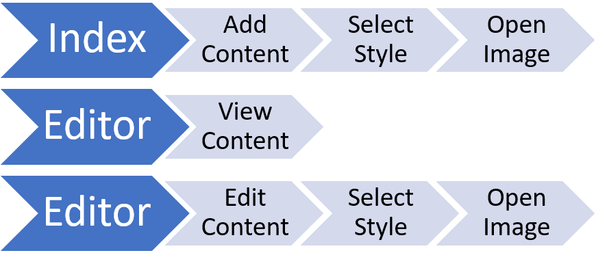

I have chosen to allow a user to edit the content of a created image as it allows for a more powerful workflow where bugs within code can be fixed and shared easily.

#### REST API

The API will contain one route which will allow for the image data to be sent and a JSON object containing an array of URLs returned which will be the location of the created images in their respective formats. This API will follow a versioning design where their is a value such as `v1` within the route to differentiate existing and new API versions that may contain breaking changes.

The route I have chosen is `/api/v1/create` as this creates a direct and understandable route for developers to understand. The route will only accept a `POST` request as data needs to be sent to the endpoint in order for the data to be used in the creation of the images.

An API is perfect for this process as it allows any program to access the service over a single endpoint and it can be easily monitored and updated to fix any issues. This is better than having a user install a created package as this requires them to update it manually themselves if there is a new version and requires them to install and configure the program themselves.

I have chosen to return a JSON object as it can be easily manipulated both by myself and developers using the endpoint. It is also the normal object type to be returned over a REST API and therefore will be natural for developers as to avoid any confusion. The reason I don't return an image directly as this would only return one image, which the developer would have to store and handle themselves. If this is the case, they will use a local path and therefore the logic I will have created to show an editor will not be present as they will receive the image as served from the local developer's server.

### 3.2.2 Describe the solution

#### Module Hierarchy

The image below is the model hierarchy to show where the packages are stored in relation to the route directory. I will explain what each package aims to do further down below. Level one is the route `/` and contains the entry point for the project. This is simply a file which initialises each modules start function. I will use this function to allow for queue creation or subscription events, which is described in more detail later on, or to connect to a database before the rest of the program starts if I needed to do so. This file will look something like so:

```go
// main.go
package veoir

import (
  "github.com/baileyjm02/veoir/pkg/router"
  "github.com/baileyjm02/veoir/pkg/catalogue"
  "github.com/baileyjm02/veoir/pkg/engine"
  // ... all other packages
)

func main() {
  router.Start()
  catalogue.Start()
  engine.Start()
  // ... other start functions for other packages
}
```


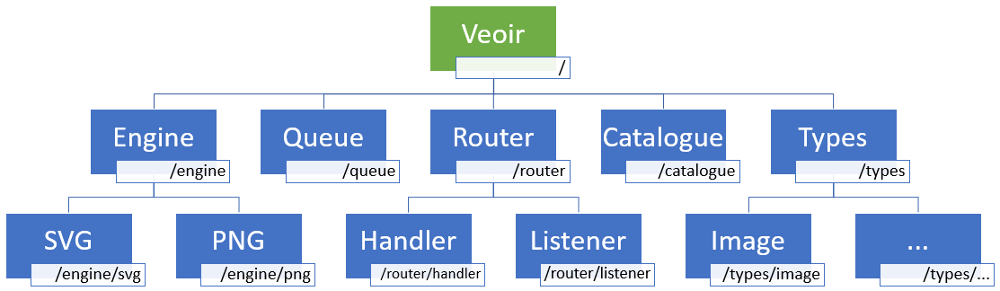

#### Engine Package

The engine package is used to import each image creation function into the main scope of the project and start their queue listeners. This high level package acts as a wrapper to ensure we can include each image type and expand to offer other image encoding types in the future easily while only having to change one area of the project. For example, the code to initiate the SVG and PNG encodings will look like so:

``` Go
// engine/engine.go
package engine

import (
  "github.com/baileyjm02/veoir/pkg/engine/svg"
  "github.com/baileyjm02/veoir/pkg/engine/png"
)

// Called from main.go
func Start() {
  svg.StartQueue()
  png.StartQueue()
}
```
This allows me to create a new image encoding engine, for example JPEG, and store it in `github.com/baileyjm02/veoir/pkg/engine/jpeg`. I can then import this and start the queue with `jpeg.StartQueue()` from the engine module's `Start` function. This is beneficial as it ensures all processes are started from one place. 

#### Engine SVG/PNG Packages

Each of the encoding modules will follow the same layout in design where they will create a queue which they subscribe too, and wait until an event is sent. Once an event is sent, they will then act on this data, creating an image which can be returned. An example for the PNG package:

```go
// engine/png.go
package engine

import (
    "github.com/baileyjm02/veoir/pkg/queue"
)

// StartQueue subscribes to the PNG event channel
func StartQueue() {
  // make the channel
    channel := make(chan queue.DataEvent)
  // subscribe to the channel
    queue.Queues.Subscribe("createPNG", channel)
  // for loop waiting until there is an item in the channel
    for {
        select {
        case data := <-channel:
      // call the BuildPNG with the sent data
            go BuildPNG(data.Image))
        }
    }
}

// BuildPNG will perform the tasks to create the PNG from the SVG image
func BuildPNG(Type Image) {
  // ...
}
```

This layout will follow the same for SVG as well as JPEG or GIF etc. where the only difference will be the logic performed within the `Build<Type>()` function depending on what image needs to be created. 

The big difference between the normal encodings (PNG, JPEG) and the SVG module I have created is that the SVG is our base image. This was highlighted before but it's due to the fact we can easily manipulate this as text. Therefore, the `BuildPNG` function will have to make a call to the `createSVG` queue and wait for the SVG to be returned back along the queue. This adds a small amount of complexity to each encoding module but is a nice level of abstraction as it ensures readability and prevents code being repeated for the creation of the SVG.

The `Build<Type>()` function takes a parameter of type `Image`, which his passes all of the data we need. The image type looks like so:

```go
type Image struct {
    Payload  []byte
    Encoding string
    Theme    string
    Hash     string
}
```

The `Payload` is the actual image data in an array of bytes so we don't have to keep encoding and decoding to and from a string or other binary data as this would add time to each process. The `Encoding` is a string and relates to the type of image, for example `image/png` as I am following the HTTP Content-Type to avoid confusion when sending data to the HTTP server. The `theme` at the moment will have two values: "dark" or "light" and this relates to the colour value of the image we are creating. The `Hash` is the image name or title, we are using a hash to create short URL paths that have a very small chance of collisions thus reducing the chance of an error due to file duplication. This is explained more in the Hash Package section.

To build the SVG, I have two options, I can either programmatically generate an SVG using `ajstarks/svgo` package or I can create a template file and alter it. I have chosen to programmatically generate the SVGs as this is quicker as it is capable of using buffers. It also allows me to set different heights and widths depending on the text within. By default, I will add padding around the edge of the text to ensure it fits within the image sizes declared in the Success Criteria.

An example of the SVG function using the `ajstarks/svgo` package I will be implementing is:

```go
func BuildSVG(img Image) {
    width := 500
    height := 500
    canvas := svg.New(buffer)
    canvas.Start(width, height)
    canvas.Roundrect(width-20, height-20, 460, 460)
    canvas.Text(width/2, height/2, string(img.Payload), "text-anchor:middle;font-size:30px;fill:white")
    canvas.End()
}
```

This will output the created SVG to the `buffer` and allow me to save it to a file and pass this to the PNG creation function.

####  Queue Package

The queue package is the heart of the program as it handles the communicated between all other packages while enabling a decoupled environment. This is also know as micro-services though this implementation isn't an exact representation as they all have a single entry point within the `main.go` file. However, in the future it will be possible to move this to a complete micro-service and have the queue package handle events over multiple servers and processes. This also allows for the introduction of load balancing where extra logic is used within the queue package. For example, to send data within a queue to one node or another if there were two identical catalogue processes based on how many queue events one node is already handling.

The queue package I will be implementing at the moment will be a simple design using Go channels<sup id="ix">[x](#fx)</sup>. These can be used to pass data from one Go routine<sup id="ix">[x](#fx)</sup> to another. I use buffered Go channels as these allow for multiple entries to be send 'along' the channel without having to wait for it to be cleared.

In my project, I am planning on using the following structure from the figure below for my queue structure. In this structure, the HTTP request handler ('Handler') is the centre node which sends and receives requests from both the Catalogue package and the encoding engine packages. This allows it to orchestrate the cycle of events by utilising the queues and waiting for values to be returned. At the moment this will all have to take place within one project but using techniques mentioned above, this could be split over multiple nodes or servers using the queues as a communication structure.

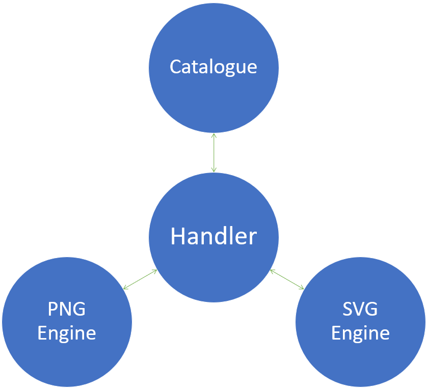

The code for a queue to be created by one of the sub-packages will look like so:

```go
// create a channel structure with a buffer size of 5
channel := make(chan queue.DataEvent, 5)
// Subscribe creates a queue with "queueName" and adds it to the Queues structure so
// other functions can send data to the channel using queue.Queues.Publish("queueName", payload)
queue.Queues.Subscribe("queueName", channel)
// For loop always checking if there is new data in the channel to be read
for {
  select {
  case payload := <-channel:
    // data was found, run a function passing in the data as a parameter
    go function(payload.Data)
  }
}
```

This will need to be called at some point before any data is published to the channel as an error will declared due to there not being a channel that the payload can be published too. To publish data to a channel a package can use this function:

```go
queue.Queues.Publish("queueName", payload)
```

The queue package itself will have to contain the logic to store the array of channels so they can be subscribed to and data can be sent to them. As each Go channel can contain only one data type, similar to that of an array, we will have to create our own custom type to allow us to send data along the queue and know what to expect to receive on a subscribing package. For this, we will create the `DataEvent` type.

```go
type DataEvent struct {
    Data  interface{}
    Topic string
}
```

This will contain the `Data` and the `Topic`, the data variable is of the type `interface`, this is basically a type which can be either a byte array, string or number. This goes against my strict types as it is unknown what this type can be, however, it is beneficial is this case as the `interface` type can be handled the same way regardless of what type it actually is. It also prevents instances where strict types are actually harmful. For example, this queue package will be imported by multiple other packages which may be using different data types. To ensure that there is still a somewhat known value being sent, I will create multiple types that will be sent *as* data along the queue. For example, I may create a type `Image` which I send in place of the data ensuring I know how to interact with it when I receive it. The `Topic` value is a string which will hold the name of the queue so we know where the `DataEvent` needs to be sent.

I will then create a channel which allows our `DataEvent` to be sent. This can simply be done by declaring a type of channel (`chan`) like so:

```go
type DataChannel chan DataEvent
```

For the queues package to be able to handle multiple `DataChannel `instances with different names, we have to create a 'slice' this is similar to a list if no length value is set, or an array if a length value is set. I won't be setting a length value as I don't want to create a bottleneck where data can't be passed into the queue. To do this, we create another type which is a list of `DataChannel` types.

```go
type DataChannelSlice []DataChannel
```

This allows us to now create our `EventBus` type which will contain a `rm` value and a `topics` value: 

```go
type EventBus struct {
    topics map[string]DataChannelSlice
    rm     sync.RWMutex
}
```
The attribute `topics` is a map with an indexing convention of `string` which means a list where each `DataChannelSlice` can be accessed with a string like `topics["topicOne"]` . An example value of `topics` could be displayed like so with different levels of abstraction:

```go
// All example topics below are identical, just displayed with different levels of abstraction
// and different indexing names
[
  "exampleTopic1": DataChannelSlice,
  // or, expanding the DataChannelSlice type
  "exampleTopic2": []DataChannel,
  // and finally, expanding the list of DataChannel types
  "exampleTopic3": [
    (chan)DataEvent
    (chan)DataEvent
    (chan)DataEvent
  ],
]
```

`rm` is part of Go's `sync` package and it is used to prevent race conditions when accessing data.

A race condition occurs when data is being accessed, read and written by multiple threads or concurrent processes. The Go `sync` package allows a variable to be locked where its contents can not be written to by any other processes other than the one that called the lock function. This is really useful to ensure that a variable is not being written to at the same time which can cause undesired effects. For example, if we have two separate threads trying to write a new data object to the queue, they may both copy an list such as `[item1, item2]` at the same time, they both get the same data so this is fine. However, due to concurrent processes having external factors such as CPU wait times they may try to add a variable to this array at different times before either one has rewritten their changes. If we had two threads, number one adding `item3` and two adding `item4` there may be an instance where thread number one adds `item3` to the list and rewrites this variable. Any process fetching this variable will now receive `[item1, item2, item3]`. This is what we expected to happen. However, as thread number two copied the variable at the same time, but took longer to add its value and rewrite the variable, once it has finished executing, the list now becomes `[item1, item2, item4]`. This means that `item3` is no longer present in the list and the data has been lost. This is important to prevent in a program such as mine as a user expects their image to be created, and we can't lose their data.

The sync package is used within the subscribe and publish functions, I am able to access the `rm` module as the functions act on the structure using interfaces which are similar to methods within the class. I pass the `EventBus` value as a reference so we are able to manipulate the data directly from the type. This also means that the data we change is stored within the struct as we expect. The two functions will look like so:

```go
func (eb *EventBus) Subscribe(topic string, ch DataChannel)
func (eb *EventBus) Publish(topic string, data interface{})
```

Discussing the Subscribe function first, it takes two parameters: `topic`, which is a string, and `ch`, which is a DataChannel. The variable `eb` is also accessible within the scope of the function and this is the EventBus that the function is being called upon. The publish function is most the same, however the `ch` parameter is replaced by an interface type with the name `data` so data can be passed into the queue.

The subscribe function is the simplest of the two as the logic is basically if a topic is found, add the channel given to the topic's DataChannel list, if not create a new topic and follow the same process with adding the channel to the DataChannel list. We also create a lock on the EventBus struct to prevent race conditions on the data as we need to append to lists which means reading and writing data. We do this using the `sync.RWMutex.Lock()` function, however, as we already pass `sync.RWMutex` as `rm` within the EventBus, which can be accessed via `eb` we call `eb.rm.Lock()`. It is important to reference the same `sync.RWMutex` type here as this allows the package to check if the data is already being accessed due to them referencing the same memory containing the required data. The function used will look like so, using `eb.rm.Unlock()` to remove the lock on the data once it is finished being manipulated.

```go
func (eb *EventBus) Subscribe(topic string, ch DataChannel) {
    eb.rm.Lock()
    if prev, found := eb.topics[topic]; found {
    // If topic has been found, append the channel to the exisitng DataChannel list
        eb.topics[topic] = append(prev, ch)
    } else {
    // Else append the channel to a new empty DataChannel list
        eb.topics[topic] = append([]DataChannel{}, ch)
    }
    eb.rm.Unlock()
}
```

The publish function will be slightly more complicated. As it will use the same process for locking and unlocking the data however, it will include a sub-goroutine to ensure the data is passed to all of the channels as quickly as possible. The function will look like so:

```go
func (eb *EventBus) Publish(topic string, data interface{}) {
    eb.rm.RLock()
    if chans, found := eb.topics[topic]; found {
        channels := append(DataChannelSlice{}, chans...)
        go func(data DataEvent, dataChannelSlices DataChannelSlice) {
            for _, ch := range dataChannelSlices {
                ch <- data
            }
        }(DataEvent{Data: data, Topic: topic}, channels)
    }
    eb.rm.RUnlock()
}
```

The logic within the function checks if a channel with the name passed as `topic` is in the map. If it is, we then enter a goroutine to loop over the channels and send data to them. I have chosen to enter a goroutine here as we no longer need to lock the list of channels as we have read the ones we need. Therefore we can start a separate process using the data we now have. This also stops the publish function from blocking the routine it was called from any longer than necessary.

#### Router Package

The router package contains two sub-packages: listener and handler. The router package will contain a list of routes we are using to server and receive data. This is where we are able to include the `HttpRouter`<sup id="i8">[8](#f8)</sup> and configure the paths which we will later import into our listener package. This package allows us to create templates which are useful for when we are matching image routes via our hashes. The list of routes I will be using are:

- `GET /` - Home page
- `GET /<hash>` - Editor page
- `GET /<hash>.<encoding>` - Image
- `GET /raw/<hash>.<encoding>` - Raw image with no logic to move to editor
- `POST /api/v1/create` - API endpoint

To add these to the program, we will use the following:

```go
router := httprouter.New()

router.POST("/api/v1/create", EngineHandler)

router.GET("/", IndexHandler)
router.GET("/:hash.:encoding", BrowserHandler)
router.GET("/:hash", EditorHandler)

router.GET("/raw/:hash.:encoding", RawHandler)
```

If we wrap this in a function like so:

```go
func GetRouter() http.Handler {
  // ...
  return router
}
```

We can then call this from within our listener package and return the router instance we created with our paths. This allows the project to be split so we know all paths are kept in one file, this is important as each path has a hierarchy. This is why the file paths start at the longest as they are more specific and therefore harder to match. For example, `/hash.svg` will match both `/:hash` and `/:hash.:encoding` therefore we need to place the latter first as we want it to be handled by the function `BrowserHandler` and not `EditorrHandler`.

The listener package will be where the code for the webserver is stored. This is the area which starts the server listening for HTTP requests. For the HTTP server I will be using the standard `net/http` package from Go as it is very powerful, however, I will need to amend a few default values so the server is production ready. This is because some of the default values are set to extremely long values or are set to 0, which disables them. Cloudflare has written an [extensive blog post](https://blog.cloudflare.com/the-complete-guide-to-golang-net-http-timeouts/) on how to set up a production-ready Go HTTP server and HTTP client. After reading this article I decided to declare the server type with the following values:

```go
server := &http.Server{
  Addr:         os.Getenv("address"),
  Handler:      GetRouter(),
  ReadTimeout:  5 * time.Second,
  WriteTimeout: 10 * time.Second,
}
```

The `Addr` fetches an environment variable I can set easily depending on whether I am developing locally where I may use a value such as `localhost:3000` to start the HTTP server listening on port 3000. However, I can use the value `localhost:80` to start the server listening on port 80 on a production server. Port 80 is the default HTTP port. The `Handler` is the routes which we declared in the main router package file where we created the function `GetRouter` which returns the `http.Handler` type the `net/http` package requires within this value. The read and write timeout was altered due to the blog post as these are originally set to 0 which disables a timeout and can result in errors when users are trying to visit the server.

To start the server listening with these variables, we call the `ListenAndServe` function from our altered `http.Server` struct:

```go
err := server.ListenAndServe()
```

This function is a blocking function and needs to be called at the end of the file, it also returns an error value if there an error has occurred so we are able to check this using the code below and we also check if the error is not equal to a server close as this would be an expected behaviour and doesn't need to be reported as an error.

```go
    if err != nil && err != http.ErrServerClosed {
        log.Fatal(err)
    }
```

The `log.Fatal` function outputs the error we are shown and stops the program with an status code of 1. This is useful when writing external start and stop scripts.

The handler package contains all of the logic for what happens with each request. This means will have the following functions: `EngineHandler`, `IndexHandler`, `BrowserHandler`, `EditorHandler ` and `RawHandler` as these were listen in our listener package and attached to each route. Each function will take the same parameters and these will be as follows:

```go
func Handler(rw http.ResponseWriter, req *http.Request, ps httprouter.Params)
```

The `http.ResponseWriter` passed into the function scope as `rw` allows us to send data back to the requesting server. For the API, we will send a JSON body back with the links we have created via the image engine package.  The `http.Request` type passed into the function by reference as `req` allows us to manipulate the HTTP request such as fetch the body and headers. This is very useful for the API function. It also allows us to close the body once the handler function has finished as this closes the buffer relating to the data and frees up system and program resources.

The `EngineHandler` function is slightly different to the others as this relates to the API. This means it has to read the body and headers of the request and send these to the image engine packages to be processed. It also incorporates the Catalogue package to fetch the hash relating to the image and ensure it hasn't been selected before as this would either overwrite and existing image or cause an error as the file would not be creatable as it already exists - both of which I do not want to happen.

Therefore, we need to create a call to the Catalogue package. Here I am using a direct call and not a queue as this is a fundamental call that is simple in nature and using a queue would delay the response and add unneeded overheads. The call will look something like: `Catalogue.Generate()` which will return a string.

We will then create a new `Image` struct with the name, payload from the request and the image type. All of this will make the function look something like below:

```go
func EngineHandler(rw http.ResponseWriter, req *http.Request, ps httprouter.Params) {
    var image types.Image
    defer req.Body.Close()

    payload, err := ioutil.ReadAll(req.Body)
    if err != nil {
        log.Error(err)
    }

    // Populate the struct
    image.Encoding = req.Header.Get("X-Veoir-Image-Encoding")
    image.Theme = req.Header.Get("X-Veoir-Image-Theme")
    image.Payload = payload
    image.Hash = Catalogue.Generate()

    switch encoding := image.Encoding; encoding {
    case "svg":
        queue.Queues.Publish("engine.svg", image)
        return
    case "png":
        queue.Queues.Publish("engine.png", image)
        return
    default:
        rw.WriteHeader(501) // Return 501 Not Implemented Request as we don't support that function
        return
    }
  
    // Send response JSON
}

```

The `defer` keyword is used as this runs the function to the right of it after the `EngineHandler` function has finished execution. If the encoding was found and the HTTP code of `501` was not sent back to the server then we need to send the JSON object back with the array of links.

For handling the webpages, I will be using the Go `html/template` package which allows me to include a HTML template and input a variable from go. The template file can look similar to below:

```html
<h1>Page Title</h1>
<body>
    <code>
        {{.Payload}}
    </code>
</body>
```

The `{{.Payload}}` text will be replaced with the `Payload` variable passed to it when the HTML is being built. To use this function within the `EditorHandler`, I will first need to get the content of the image being requested. To enable us to do this, when we receive the payload of the image I will store this is a separate non-image file, such as `<hash>.json` which can be found easily by us selecting the hash given to us from the URL and then reading the JSON data included in that file which will include the style and content of the image so we can return it as text and allow us to copy the code. The code containing the logic for this would look something like below:

```go
func EditorHandler(rw http.ResponseWriter, req *http.Request, ps httprouter.Params) {
  var image Image
  jsonBytes, err := ioutil.ReadAll(ps.GetHash() + ".json")
  if err != nil {
      log.Fatal(err)
  }
  json.Unmarshal(jsonBytes, &image)
  tmpl, err := template.ParseFiles("editor.html")
  if err != nil {
      log.Fatal(err)
  }
  tmpl.Execute(rw, image)
} 
```

This will work the same for the `IndexHandler` however I won't need to open any JSON files as we will be starting with a blank document.

The direct image handlers for `/<hash>.<encoding>` or `BrowserHandler` will act differently as they will need to decide whether the request is coming from a browser - i.e. a user, or a server which will expect an image. To do this, I will redirect a browser from `/<hash>.<encoding>` to `/<hash>` using  a 302 direct. If they are not a browser, I will server the image by reading the file and sending this to the `http.ResponseWriter` with a head set for the correct image type. 

#### Catalogue Package

The catalogue package is used to generate the hash name of the image. At the moment this is a very simple package containing one function `Generate()` which will return a string using a random hash from the `hash/crc32` algorithm. I chose CRC-32 as this returns a value of 8 characters and digits. This enables the images to be unique but ensure the path isn't too long as this would cause confusing path lengths and names for images and the website.

This package will use a random number to then hash and generate our value that we will return. Although there may be an issue with concurrent processes generating the random number from the same timestamp, this is very unlikely therefore I have decided to use the `math/rand` package instead of the `crypto/rand` package as the crypto is more secure but slower and security isn't a priority as we aren't generating password salts etc. The crypto package is slower as it uses the operating system CSPRNG APIs and not the system time.

#### Types Package

The types package doesn't contain any importable functions and instead includes all the different structs that we import across multiple packages. Such as the `Image` struct. This is to eliminate the need to import every package just to use the types, instead we can import the `Types` package provide all of these for us.

### 3.2.3 Describe the approach to testing

|                      Case                      |                                    Test Procedure                                    |                                  Expected Outcome                                  |                                                                               Justification                                                                               |
| :--------------------------------------------: | :----------------------------------------------------------------------------------: | :--------------------------------------------------------------------------------: | :-----------------------------------------------------------------------------------------------------------------------------------------------------------------------: |
|                API Create Image                |                I will call the API with the correct headers and body.                | That data returned is a JSON object and the included links and images are created. | This is very important as this process will ensure the images are being created correctly. This step is crucial as the webpages also use this API when generating images. |
|                  Visit Index                   |                       I will open the route URL in a browser.                        |      That I am shown the HTML page parsed from the index.html template file.       |                                         This will allow user to view my service and they can continue to create an image if need.                                         |
|             Create Image via Index             |                    I will use the index page to create an image.                     |       That an image is created and I am shown the links to the image files.        |                          This will allow user to interact with my service without technical knowledge of the API or how to create a call to it.                           |
| Fetch the image from a non-browser user-agent. | Make a request to the image via software that does not contain a browser user-agent. |            That an image header is returned and the image is returned,             |                                                 This ensures is can be included on websites without any unknow behaviour.                                                 |
|   Fetch the image from a browser user-agent.   |                           Open the image URL in a browser.                           |                        I am redirected to the editor page.                         |                                          This is a fundamental feature that differentiates my product from other similar tools.                                           |


## 3.3 Developing the solution

<details><summary>Section check list</summary>

**To do:**

- [ ] Provided evidence of each stage of the iterative development process for a coded solution relating this to the break down of the problem from the analysis stage and explaining what they did and justifying why.
- [ ] Provided evidence of prototype versions of their solution for each stage of the process.
- [ ] The solution will be well structured and modular in nature.
- [ ] Code will be annotated to aid future maintenance of the system.
- [ ] All variables and structures will be appropriately named.
- [ ] There will be evidence of validation for all key elements of the solution.
- [ ] The development will show review at all key stages in the process.

</details>

<details><summary>Section notes</summary>
**Notes:**

- Talk through the development of your program
- Show you have systematically tested the code you have written as you go along
- Do not hide mistakes, talk about them

</details>

### 3.3.1 Iterative development process

<details><summary>Section check list</summary>

**To do:**

- [ ] Provide annotated evidence of each stage of the iterative development process justifying any decision made.
- [ ] Provide annotated evidence of prototype solutions justifying any decision made.

</details>

> Why I had to create a type for queues with the hash and completed value. 

#### Setting up the project

To setup the project I had to create the correct file structure. This was to ensure I knew which files were where and so I could import them into my other packages with ease and simplicity. Therefore, my file structure looks like so:

- **/main.go**: The main entry file of the project.
- **/public**: The folder we place all of the images created.
- **/templates**: The HTML files used for the index and editor
  - **/index.html**
  - **/editor.html**
- **/pkg**: The folder where we place all of the packages we can import
  - **/engine**
    - **svg.go**
    - **png.go**
  - **/logger**
    - **logger.go**
  - **/queue**
    - **queue.go**
  - **/catalogue **
    - **catalogue .go**
  - **/router**
    - **handler.go**
    - **listener.go**
    - **router.go**
  - **/types**
    - **image.go**

When this has all been compiled, on a server the only needed files will be a built executable and the `/public` folder.

To start the program, we need to use an entry point which will be the `main.go` package. Here we will import the  `logger` package so we can format it using a special `init()` function, like so:

```go
package main

import (
    "github.com/baileyjm02/veoir/pkg/logger"
)

func init() {
    // Format the logger so we can import logrus and have the expected output in all areas
    logger.Format()
}

func main() {
}
```

As I am using a 3rd-party logger I need to format the logger to how I want it to be displayed. By default the logger would look like this:

```log
Starting server on 192.168.0.93:3344
```

This shows me the server has started but does not tell me if it was an error, or where the output was created. However, by formatting my the logger using the following file in the logger package:

```go
package logger

import (
    "fmt"
    "runtime"
    "strings"

    "github.com/sirupsen/logrus"
)

// Format configures the logrus logger output, this only needs to be called once.
func Format() {
    logrus.SetReportCaller(true)
    formatter := &logrus.TextFormatter{
        ForceColors:            true,                  // Don't check for TTY
        TimestampFormat:        "02-01-2006 15:04:05", // the "time" field configuration
        FullTimestamp:          true,
        DisableLevelTruncation: true, // log level field configuration
        CallerPrettyfier: func(f *runtime.Frame) (string, string) {
            // this function is required when you want to introduce your custom format.
            // In my case I wanted file and line to look like this `file="engine.go:141`
            // but f.File provides a full path along with the file name.
            // So in `formatFilePath()` function I just trimmet everything before the file name
            // and added a line number in the end
            return "", fmt.Sprintf("(%s:%d)", formatFilePath(f.File), f.Line)
        },
    }
    logrus.SetFormatter(formatter)
}

// formatFilePath is a small helper function to return the file of which the log originates and
// not the whole path
func formatFilePath(path string) string {
    arr := strings.Split(path, "/")
    return arr[len(arr)-1]
}
```

I am able to turn that same output into this:

```log
INFO[02-02-2021 14:17:49](listener.go:23) Starting server on 192.168.0.93:3344
```

This has much more useful information as it has the exact time it was called, along with the status (info) and the file name with the line. I had already used this logger style before in a previous program so it was not too tricky to figure out. In addition, this package allows me to call separate functions for each log type such as `Info`, `Warn`, `Fatal` and a few others, though I probably will not be using the others as often. 

However, before we can start calling the start functions from the main package, I would like to create the queue package first as it is a utility that can be used throughout development.

#### Queue Package

The queue package is a really useful utility for modular programs and it challenges my knowledge of more intricate ideologies such as channels and access locks. From my design layout in the solution I had a good idea of how to complete the package as it's something I had to research a lot into before I even started writing the code for the design and I therefore had to do some separate iterative development in order to understand what each part of the code should do what. The functions and types have stayed mostly the same, however I have now added a `Bus` interface which allows me to declare functions onto a struck as if they were functions of a class. To do this, I had to declare them like so:

```go
// Bus an interface for publishing and subscribing to events
type Bus interface {
    Publish(topic string, data interface{})
    Subscribe(topic string, ch DataChannel)
}
```

I then had to alter the `EventBus` type and include `Bus`:

```go
type EventBus struct {
    Bus
    topics map[string]DataChannelSlice
    rm     sync.RWMutex
}
```

In addition to this introduction, I have also created a new exportable variable called `Queues` which is an `EventBus` struct. I had to create this within the queue package so I could import the package and access the `EventBus `struct with all of the topics stored via `queue.Queues`. This is because I realised that if I kept creating a new `EventBus` each time I imported the queue package, this wasn't global and therefore prevented me from sharing the topics between packages. With these final changes, the `queue.go` package file now looks like so:

```go
package queue

import (
    "sync"
)

// Queues contains an array of all subscribable channels
var Queues = &EventBus{
    topics: map[string]DataChannelSlice{},
}

// EventBus stores the information about topics interested for a particular topic
type EventBus struct {
    Bus
    topics map[string]DataChannelSlice
    rm     sync.RWMutex
}

// Bus an interface for publishing and subscribing to events
type Bus interface {
    Publish(topic string, data interface{})
    Subscribe(topic string, ch DataChannel)
}

// DataEvent is the type sent over an event, importantly it contains the topic name as there
// are multiple channels
type DataEvent struct {
    Data  interface{}
    Topic string
}

// DataChannel is a channel which can accept an DataEvent
type DataChannel chan DataEvent

// DataChannelSlice is a slice of DataChannels
type DataChannelSlice []DataChannel

// Publish pushes events onto the event channel matching the topic name
func (eb *EventBus) Publish(topic string, data interface{}) {
    eb.rm.RLock()
    if chans, found := eb.topics[topic]; found {
        // this is done because the slices refer to same array even though they are passed by value
        // thus we are creating a new slice with our elements thus preserve locking correctly.
        channels := append(DataChannelSlice{}, chans...)
        go func(data DataEvent, dataChannelSlices DataChannelSlice) {
            for _, ch := range dataChannelSlices {
                ch <- data
            }
        }(DataEvent{Data: data, Topic: topic}, channels)
    }
    eb.rm.RUnlock()
}

// Subscribe allows channels to be watched as events are received
func (eb *EventBus) Subscribe(topic string, ch DataChannel) {
    eb.rm.Lock()
    if prev, found := eb.topics[topic]; found {
        eb.topics[topic] = append(prev, ch)
    } else {
        eb.topics[topic] = append([]DataChannel{}, ch)
    }
    eb.rm.Unlock()
}
```

#### Router Package

The router package has 3 separate files as it's an intricate section of the project. In order to create the routes the server should listen on, I have to first create the handlers. Therefore I have created the handlers with a simple log output so we know if they have been correctly configured. The `handler.go` file now looks like below as this will help with development:

```go
package router

import (
    "net/http"

    "github.com/julienschmidt/httprouter"
    "github.com/sirupsen/logrus"
)

func EngineHandler(rw http.ResponseWriter, req *http.Request, ps httprouter.Params) {
    logrus.Info("API Success")
}

func IndexHandler(rw http.ResponseWriter, req *http.Request, ps httprouter.Params) {
    logrus.Info("Home page")
}

func BrowserHandler(rw http.ResponseWriter, req *http.Request, ps httprouter.Params) {
    logrus.Infof("Editor page - hash: %v encoding: %v", ps.ByName("hash"), ps.ByName("encoding"))
}

func EditorHandler(rw http.ResponseWriter, req *http.Request, ps httprouter.Params) {
    logrus.Infof("Editor page - hash: %v", ps.ByName("hash"))
}

func RawHandler(rw http.ResponseWriter, req *http.Request, ps httprouter.Params) {
    logrus.Infof("Editor page - hash: %v encoding: %v", ps.ByName("hash"), ps.ByName("encoding"))
}

```

Now I have the logging setup, I can continue to setup the routes. The `router.go` file looks like below, ensuring we import the `julienschmidt/httprouter` package.

```go
package router

import (
    "github.com/julienschmidt/httprouter"
)

// GetRouter returns a list of routes avaliable and being listened too on the server
func GetRouter() *httprouter.Router {
        // Add the endpoint for engine payloads
        router := httprouter.New()
        // API

        router.POST("/api/v1/create", EngineHandler)
        // Frontend
        router.GET("/", IndexHandler)
        router.GET("/:hash.:encoding", BrowserHandler)
        router.GET("/:hash", EditorHandler)
        
        // Raw image
        router.GET("/raw/:hash.:encoding", RawHandler)

        return router
}
```

Next, we can move into the `listener.go` file. This is the file where we start the HTTP server and setup the server configurations. This also calls the function `GetRouter()` declared in the router package which is why we had to create this first. The code below declares the `http.Server` struct, logs that we are starting the server and starts the server, waiting for any errors that may occur.

```go
package router

import (
    "net/http"
    "os"
    "time"

    "github.com/sirupsen/logrus"
)

// Start initiates the HTTP server for webhooks and requests the bot to start
func Start() {

    // Start the HTTP server ()
    server := &http.Server{
        Addr:         os.Getenv("address"),
        Handler:      GetRouter(),
        ReadTimeout:  5 * time.Second,
        WriteTimeout: 10 * time.Second,
    }

    // Inform us that we are starting the server
    logrus.Infof("Starting server on %v", server.Addr)

    // Start the server
    err := server.ListenAndServe()
    if err != nil && err != http.ErrServerClosed {
        logrus.Fatal(err)
    }
}
```

To test this, I need to call the `router.Start()` function from `main.go`. To do this, we need to now import the router package and call the function. `main.go` now looks like below:

```go
package main

import (
    "github.com/baileyjm02/veoir/pkg/logger"
    "github.com/baileyjm02/veoir/pkg/router"
)

func init() {
    // Format the logger so we can import logrus and have the expected output in all areas
    logger.Format()
}

func main() {
    // Start the router package
    router.Start()
}
```

To run this file, I have to run `go run main.go` on the command line. As I am including an environment variable while using windows, I also have to declare this inline with the go command. Therefore it now looks like so: `$Env:address='localhost:3344'; go run main.go`.

This resulted in the following error: `panic: only one wildcard per path segment is allowed, has: ':hash.:encoding' in path '/:hash.:encoding'`. This means that the following line is causing us an error from the routes package:

```go
router.GET("hash.:encoding", BrowserHandler)
```

I had to check the documentation again and we are unable to use two variables (`:hash` and `:encoding`) in one route to match a path. This means that the `RawHandler` route will also encounter this error. To fix this, I need to change `:hash.:encoding` to `:path` so we are using one variable. Unfortunately, this means it also overwrites our `EditorHandler` route so I need to change this too. After this error and following ones with path conflicts relating to `:path` also matching `/raw/:image` I had to change the  `GetRouter` function to:

```go
// Add the endpoint for engine payloads
router := httprouter.New()

// Frontend
router.GET("/", IndexHandler)
router.GET("/i/:image", ImageHandler)
router.GET("/editor/:image/", EditorHandler)

// Raw image
router.GET("/raw/:image", RawHandler)

// API
router.POST("/api/v1/create", EngineHandler)

return router
```

I had to introduce more path prefixes such as `/i/` for image and `/editor/` for the editor so I could break these into different handlers, I also renamed `BrowserHandler` to `Imagehandler` as the name suited the purpose more effectively. After running the start command we not get a successful server started message. The table below shows the console output compared to the route I visited in the browser:

|     Path      |         Console          |
| :-----------: | :----------------------: |
|       /       |        Home page         |
|     /test     |      (*404 error*)       |
|      /i/      |      (*404 error*)       |
|  /i/test.png  | Image handler - test.png |
| /editor/test/ |   Editor handler- test   |
| /raw/test.png |  Raw handler - test.png  |

This is working as expected.

Next, we need to edit the `BrowserHandler` to check if the `user-agent` provided is from a browser or another service in order for our redirections to work. To do this, I first decided to output the user agent I receive for Postman (not browser), Brave (Browser) and a webpage with the image route embedded. I check this last one as we don't want to redirect the user to the editor page if the link is in fact embedded as an image in a webpage.

| Accessed From  |                                                     User Agent                                                     |
| :------------: | :----------------------------------------------------------------------------------------------------------------: |
|    Postman     |                                               PostmanRuntime/7.26.8                                                |
|     Brave      | Mozilla/5.0 (Windows NT 10.0; Win64; x64) AppleWebKit/537.36 (KHTML, like Gecko) Chrome/88.0.4324.96 Safari/537.36 |
| Brave via HTML | Mozilla/5.0 (Windows NT 10.0; Win64; x64) AppleWebKit/537.36 (KHTML, like Gecko) Chrome/88.0.4324.96 Safari/537.36 |

As you can see, from the above there was no way to determine whether the request was from within HTML or not, even though it is very easy to determine if it was from a browser or not. This lead me to investigate into what headers are sent with each request and I found the `Accept` header. This lists the types of content the service calling the URL expects to find. I was also able to investigate that this has a different value for whether the URL was accessed directly, or embedded in HTML. To test this, I edited the `ImageHandler` and also imported the `strings` package provided by Go. The new code looked like below:

```go
    if strings.Contains(req.Header.Get("Accept"), "text/html") {
        logrus.Info("Request can be redirected")
    } else {
        logrus.Info("Serve the image")
    }
```

As you can see, the function checks if the request accepts the "text/html" encoding, if it does, it tells us that this request can be redirected. Copying the same table from above, these are the new results:

| Accessed From  |          Accept           |
| :------------: | :-----------------------: |
|    Postman     |      Serve the image      |
|     Brave      | Request can be redirected |
| Brave via HTML |      Serve the image      |

This is exactly what I want. This is also more developer / user / software friendly as it only send them the HTML if they accept it.

To get the image name and extension from the URL, I have written a small function that takes a string, slits it after each `.` character. This looks like so:

```go
func splitPath(path string) (types.Image, error) {
    list := strings.Split(path, ".")
    if len(list) < 2 {
        return types.Image{}, errPathToShort
    }
    return types.Image{
        Hash: list[0],
        Encodings: []string{list[1]},
    }, nil
}
```

Very basic using the `strings` package to split the path, I then initiate a new Image struct instance and populate the `Encoding` and `Hash` values. I also return a known error if the path is too short so we can return a 404, and any error that is unknown will cause a panic from within the `ImageHandker`. This allows me to get the name of the image so the program can direct to the `/editor/<hash>` route. This uses `http.Redirect` function and changes the `ImageHandler` to look like:

```go
func ImageHandler(rw http.ResponseWriter, req *http.Request, ps httprouter.Params) {
    image, err := splitPath(ps.ByName("image"))
    if err != nil && err != errPathToShort {
        logrus.Fatal(err)
    } else if err != nil {
        rw.WriteHeader(404)
        return
    }

    if strings.Contains(req.Header.Get("Accept"), "text/html") {
        logrus.Info("Request redirected")
        http.Redirect(rw, req, fmt.Sprintf("/editor/%v", image.Hash), http.StatusTemporaryRedirect)
        return
  }
    
    logrus.Info("Serve the image")
    logrus.Infof("Image page - %v", ps.ByName("image"))
}
```

I also set a HTTP status code of 307, or `StatusTemporaryRedirect` as this ensures we don't interfere with the embedded images due to smart cache. As multiple handler need to server the image, I created the `serveImage` function which looks like below:

```go
func serveImage(rw http.ResponseWriter, req *http.Request, image types.Image) {
    http.ServeFile(rw, req, fmt.Sprintf("public/%v.%v", image.Hash, image.Encodings[0]))
}
```

When adding this to the end of the `ImageHandler` file, the image matching the name and encoding is served from the `/public` folder.

This makes the `RawHandler` really simple as we only need to add a few lines. It now looks like so, and correctly returns an image regardless of the requesting medium.

```go
func RawHandler(rw http.ResponseWriter, req *http.Request, ps httprouter.Params) {
    defer req.Body.Close()
    image, err := splitPath(ps.ByName("image"))
    if err != nil && err != errPathToShort {
        logrus.Fatal(err)
    } else if err != nil {
        rw.WriteHeader(404)
        return
    }
    serveImage(rw, req, image)
}
```

Next, I need to create the `EditorHandler`. This is tricky as it requires two main parts - rendering the HTML from the template and decoding the JSON file to populate the template data. First, I am going to ensure we fetch the correct content from the JSON file. To do this, I have to incorporate the following code into the handler:

```go
func EditorHandler(rw http.ResponseWriter, req *http.Request, ps httprouter.Params) {
    defer req.Body.Close()
    data, err := ioutil.ReadFile(fmt.Sprintf("public/%v.json", ps.ByName("image")))
    if err != nil {
        logrus.Error(err)
    }

    var fullImage types.Image
    err = json.Unmarshal(data, &fullImage)
    if err != nil {
        logrus.Error(err)
    }
    rw.Write([]byte(fullImage.Hash))
}
```

After creating a test JSON file in public called `test.json` with the contents of below I was able to test this call, when visiting `/editor/test/` the text `test` is displayed which is the value of `fullImage.Hash`.

```json
{
 "payload": "func main() {\n\t// image(\"#a4a4a4\", \"#000\", \"#fff\")\n\timage(\"#E6E6FA\", \"#fff\", \"#000\")\n}",
 "encodings": [
  "svg"
 ],
 "theme": "",
 "hash": "test"
}
```

 I had a little trouble originally as I hadn't properly escaped the payload value as the text is below, which cased some encoding errors that looked like: `invalid character 'ÿ' looking for beginning of value`.

```go
func main() {
    // image("#a4a4a4", "#000", "#fff")
    image("#E6E6FA", "#fff", "#000")
}
```

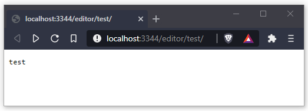

Next, I need to incorporate this into a template. For now, I am going to keep the template really simple and use the following, with little styling:

```html
<!DOCTYPE HTML>
<html lang="en">

<head>
    <title>Editor</title>
    <meta charset="UTF-8" />
</head>

<body>
    <h1>Image: {{ .Hash }} ({{ .Encodings }})</h1>
    <br />
    <code><pre>
        {{ .Payload }}
    </pre></code>
</body>

</html>
```

We can then use the following code to fetch the template and populate it with the values.

```go
    tmpl, err := template.ParseFiles("template/editor.html")
    if err != nil {
        // Log the detailed error
        logrus.Error(err.Error())
        // Return a generic "Internal Server Error" message
        rw.WriteHeader(404)
        return
    }

    err = tmpl.Execute(rw, fullImage)
    if err != nil {
        logrus.Error(err.Error())
    rw.WriteHeader(404)
    return
    }
```

Which now shows the following when I visit `/editor/test/`, this is good enough for now and I can now expand this using JavaScript to interact with our API.

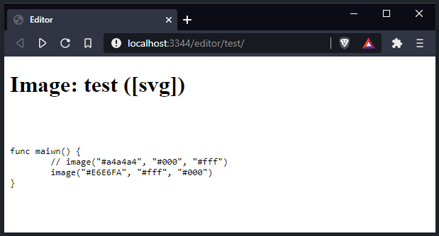

For a useful response for our `EngineHandler` as I create the interactions, I have updated the handler to return the body sent when it is accessed via a POST request. The code for this:

```go
func EngineHandler(rw http.ResponseWriter, req *http.Request, ps httprouter.Params) {
    defer req.Body.Close()
    payload, err := ioutil.ReadAll(req.Body)
    if err != nil {
        logrus.Error(err)
    }
    rw.Write(payload)
    logrus.Info("API Success")
}
```

Now I need to create the JavaScript within the HTML to send a post request to the API with the required values. Updating my template file to the following with new JavaScript as follows produces the image below.

```html
<!DOCTYPE HTML>
<html lang="en">

<head>
    <title>Editor</title>
    <meta charset="UTF-8" />
    <style>
        textarea {
            width: 35vw;
            max-width: 80vw;
            height: 25vw;
            max-height: 80vh;
        }
    </style>
</head>

<body>
    <h1>Image: {{ .Hash }} ({{ .Encodings }})</h1>
    <form id="editor">
        <textarea id="code" name="code">{{ .Payload }}</textarea>
        <input type="submit" value="Generate Images">
    </form>
    <script>
        function sendData() {
            const XHR = new XMLHttpRequest();
            // Bind the FormData object and the form element
            const FD = new FormData(form);
            // Define what happens on successful data submission
            XHR.addEventListener("load", function (event) {
                alert(event.target.responseText);
            });
            // Define what happens in case of error
            XHR.addEventListener("error", function (event) {
                alert('Oops! Something went wrong.');
            });
            // Set up our request
            XHR.open("POST", "/api/v1/create", true);
            XHR.setRequestHeader("Content-Type", "application/x-www-form-urlencoded; charset=UTF-8");

            // The data sent is what the user provided in the form
            XHR.send(FD.get("code"));
        }

        // Access the form element...
        const form = document.getElementById("editor");
        // ...and take over its submit event.
        form.addEventListener("submit", function (event) {
            event.preventDefault();
            sendData();
        });
    </script>
</body>

</html>
```

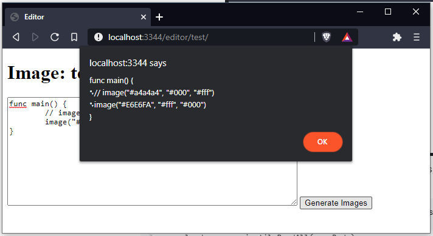

This shows me that the request is being made successfully to the server. To finalise this, I will update the data received from the API to emulate the JSON object we expect to be returned. I will also add a theme dropdown with a `light` and `dark` value. After these chances, the output after "Generate Images" had been selected was:

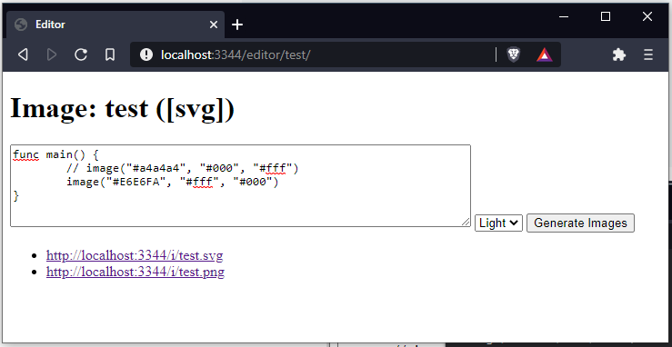

This is because the JavaScript was updated to the following where the `XHR.addEventListener("load", function (event) {})` function creates a list of links from the array returned by the API.

```javascript
const XHR = new XMLHttpRequest();
// Bind the FormData object and the form element
const FD = new FormData(form);
// Define what happens on successful data submission
XHR.addEventListener("load", function (event) {
    ul = document.createElement('ul');
    document.getElementById('listOfURLS').appendChild(ul);

    JSON.parse(event.target.responseText).forEach(function (item) {
        let li = document.createElement('li');
        ul.appendChild(li);

        li.innerHTML += "<a target='_blank' href="+item+">"+item+"</a>";
    });
});
// Define what happens in case of error
XHR.addEventListener("error", function (event) {
    alert('Oops! Something went wrong.');
});
// Set up our request
XHR.open("POST", "/api/v1/create", true);
XHR.setRequestHeader("Content-Type", "application/x-www-form-urlencoded; charset=UTF-8");
XHR.setRequestHeader("X-Veoir-Image-Theme", FD.get("theme"));

// The data sent is what the user provided in the form
XHR.send(FD.get("code"));
```

As I have already created this, the `IndexHandler` function is really simple as I just have to generate this HTML without any of the values set, as it is a new empty page. This code for this looks like:

```go
func IndexHandler(rw http.ResponseWriter, req *http.Request, ps httprouter.Params) {
    defer req.Body.Close()
    tmpl, err := template.ParseFiles("template/editor.html")
    if err != nil {
        // Log the detailed error
        logrus.Error(err.Error())
        // Return a generic "Internal Server Error" message
        rw.WriteHeader(404)
        return
    }

    err = tmpl.Execute(rw, types.Image{})
    if err != nil {
        logrus.Error(err.Error())
        rw.WriteHeader(404)
        return
    }
}
```

With a slight amendment to the HTM file, I can prevent the empty `Image: ([])` value from showing and instead show a new image title.

```html
{{ if .Hash}}
<h1>Image: {{ .Hash }} ({{ .Encodings }})</h1>
{{ else }}
<h1>New Image</h1>
{{ end }}
```

The index page now looks like:

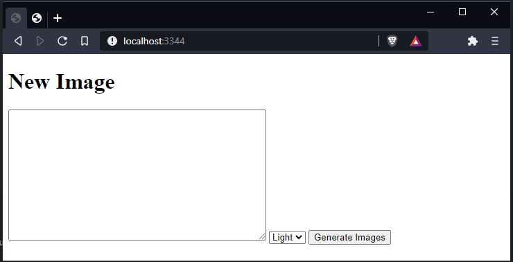

Now we have almost complete the router package, we just need to write the `EngineHandler` function. This will handle the `/api/v1/create` route and will take 2 main parameters; the theme and the code. The theme is set via a header with the title `X-Veoir-Image-Theme` and the code is sent as the `req.Body`. 

At the moment, the code for this handler looks like below as I altered it to return a set value so I could test the HTML templates with the JavaScript.

```go
func EngineHandler(rw http.ResponseWriter, req *http.Request, ps httprouter.Params) {
    defer req.Body.Close()
    list := []string{
        "http://localhost:3344/i/test.svg",
        "http://localhost:3344/i/test.png",
    }

    json, err := json.Marshal(list)
    if err != nil {
        logrus.Error("Cannot encode to JSON ", err)
    }

    rw.Write(json)
}
```

However, in this function I need to include the catalogue and queue packages as this is how we create the image hash / name and then pass this data to the engine packages to be created. To do this, I have altered the handler to use the following code:

```go
func EngineHandler(rw http.ResponseWriter, req *http.Request, ps httprouter.Params) {
    defer req.Body.Close()
    var image types.Image
    payload, err := ioutil.ReadAll(req.Body)
    if err != nil {
        logrus.Error(err)
    }

    image.Encodings = []string{"svg", "png"}
    image.Theme = req.Header.Get("X-Veoir-Image-Theme")
    image.Payload = string(payload)
    image.Hash = catalogue.Generate()
  
  file, err := json.MarshalIndent(image, "", " ")
  if err != nil {
    rw.WriteHeader(500)
  return
  }

  err = ioutil.WriteFile(fmt.Sprintf("public/%v.json", image.Hash), file, 0644)
  if err != nil {
    rw.WriteHeader(500)
    return
  }

    queue.Queues.Publish("engine.svg", image)

    list := []string{
        fmt.Sprintf("/i/%v.svg", image.Hash),
        fmt.Sprintf("/i/%v.png", image.Hash),
    }

    json, err := json.Marshal(list)
    if err != nil {
        logrus.Error("Cannot encode to JSON ", err)
    }

    rw.Write(json)
}
```

The `list` variable is hard-coded to an extent where I would have to add another path if I included another encoding type. The `catalogue.Generate()` simply returns a pre-set string as I haven't created this yet. And the `queue.Queues.Publish("engine.svg", image)` publishes the image to the queue, however as I haven't create the engine package yet, the are no functions subscribed to the queue. However, regardless of that, it successfully creates the JSON file and runs smoothly. Now I am ready to move onto the catalogue package.

#### Catalogue Package

The catalogue package at this stage is very simple as I don't check that the created value already exists - as I am creating only a small number of images it is extremely unlikely that there would be a collision using the random method. The current code for the `Generate` function is:

```go
func Generate() string {
    return "test"
}
```

This simply returns a single value so I can test that the function gets called correctly from the router package. However, we now need to import the `math/rand`, `hash/crc32` and `strconv` packages from Go. These will allow me to create a random string of number and letters with a fixed length of 8. This is because CRC-32 is a hashing algorithm that outputs 8 characters, if this was for security, such as passwords, I would be using something much longer like MD5 however, this is only to hash a random integer so I can name an image. I have chose to use the `math/rand` to produce a random number and then hash it as long numbers can appear confusing to users, but they are unlikely to be repeated and therefore the hashing package will always produce a different set of characters which are more appealing to users. They are also shorter to make it easier if a user was trying to embed an image in a place where they had a character limit.

The function I have now is:

```go
func Generate() string {
    crc32InUint32 := crc32.ChecksumIEEE([]byte(strconv.Itoa(rand.Int())))
    crc32InString := strconv.FormatUint(uint64(crc32InUint32), 16)
    return crc32InString
}
```

As we can see, there are a number of conversions taking place so I can pipe the output of one function into the parameter of the next in its required format. This function now returns an output of: `c2e532e3` or `aecba90d` as examples. After running this a few times, it became clear I was getting repeated results and I needed to investigate. In turned out that I had not seeded the random number generator correctly and I needed to create a new function `init` that would get called as the package was imported to fix this by setting the random seed to the current time:

```go
func init() {
    rand.Seed(time.Now().UTC().UnixNano())
}
```

This fixed the problem I was having.

#### Engine SVG Package

The SVG package is what we use to turn the code sent into an image that we can then process. The first function I need to create in this package is the `StartSVGQueue` function to allow us to subscribe to the `engine.svg` queue. I do this as such:

```go
func StartSVGQueue() {
    channel := make(chan queue.DataEvent, 2)
    queue.Queues.Subscribe("engine.svg", channel)
    for {
        select {

        case d := <-channel:
            go BuildSVG(d.Data.(types.Image))
        }
    }
}
```

This will be similar for all engine packages. Next, I need to create the `BuildSVG` function. For this I am importing the package `"github.com/ajstarks/svgo"` as `svg` for simplicity. This packages allows me to 'draw' the SVG. I have chosen to split this into `BuildSVG` and another internal `drawImage` function. The `drawImage` function is where I am going to create the SVG with parameters passed in such as the payload and colour theme. The `BuildSVG ` function will be responsible for selecting the correct theme based on the `Image.Theme` value and passing these into the image function, then saving the output to the correct file.

The `BuildSVG` function has to contain an if which will match `light` and default to `dark` for the theme. It will then call the build function with this like so:

```go
func BuildSVG(image types.Image) {
    lines := strings.Split(image.Payload, "\n")
    file, err := os.Create(fmt.Sprintf("public/%v.svg", image.Hash))
    if err != nil {
        logrus.Error(err)
        return
    }
    defer file.Close()

    if image.Theme == "light" {
        drawImage(file, lines, "#E6E6FA", "#fff", "#000")
    } else {
        drawImage(file, lines, "#a4a4a4", "#000", "#fff")
    }

    logrus.Infof("SVG %v created.", image.Hash)
}
```

This function splits the payload into a list of lines separated by the `\n` special character. It then creates a file which we can pass into the `drawImage` function and write too. We check for errors in the creation and ensure we close the file after it has been written too. If I didn't then when a web request was made to that URL it wouldn't work as it wouldn't be able to open and read the contents of the file.

The `drawImage` function is very interesting. The code for it is below and I'll explain what each line does under it.

```go
func drawImage(w io.Writer, lines []string, bg, box, text string) {
    width := 0
    for _, line := range lines {
        if len(line) > width {
            width = len(line)
        }
    }
    width = (width * 10) + 100
    height := (len(lines) * 26) + 30
    canvas := svg.New(w)
    canvas.Start(width, height)
    canvas.Rect(0, 0, width, height, "fill:"+bg)
    canvas.Roundrect(height/10, height/10, width-(2*(height/10)), height-(2*(height/10)), 12, 12, "fill:"+box)
    canvas.Circle(width-(height/10)-15, (height/10)+14, 6, "fill:tomato")
    canvas.Circle(width-(height/10)-30, (height/10)+14, 6, "fill:#FFDF00")
    canvas.Circle(width-(height/10)-45, (height/10)+14, 6, "fill:lime")
    for i, line := range lines {
        canvas.Text((height/10)+20, (height/10)+35+(i*20), line, "font-family:'JetBrains Mono';font-size:16px;fill:"+text)
    }
    canvas.End()
}
```

The first couple of lines loop through the list of lines to find which is the longest. This is important as it allows us to set our width value as to ensure no text is cut off. I then times the width by 10 to ensure that it matches the pixel value width of the longest line, adding 100 as padding. These values are all equal to pixels so the 100 I added is 100 pixels. The height is number of lines times 26, plus thirty. This is because each line is roughly 22 pixels tall, so we need to ensure this height, plus some extra for padding. I then initiate the SVG package and write the generated contents to the file via `w` which is the writer. After this, I create the canvas with the height and width and then create the background setting the colour. Next, I create a rectangle behind the code to act as a window using the divisions to create a boarder around this rectangle. There circles are added in the top-right for good looks and I then print the Text using a for loop. This increments the value of pixels above the text by 20px each iteration after a padding of (height/10)+35 to ensure each line is printed as a user would expect. Using this, and the code within, it creates an image like so:

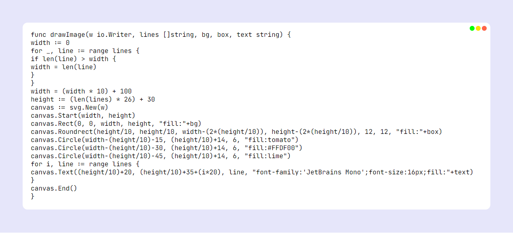

As you can see, in the code we copied there was some level of indentation, however here it is lost. To fix this, I need to alter the code slightly. I have amended the following lines to count a tab (`\t`) as 4 characters instead of 1, and this also forces the text to be printed with an ident as I draw it slightly more to the right.

```go
length := (strings.Count(line, "\t") * 2) + len(line)
if length > width {
  width = length
}

// ...

canvas.Text((height/10)+20+(strings.Count(line, "\t")*16), .......
```

Running the code again reusing the previous input produces an output of the image below.

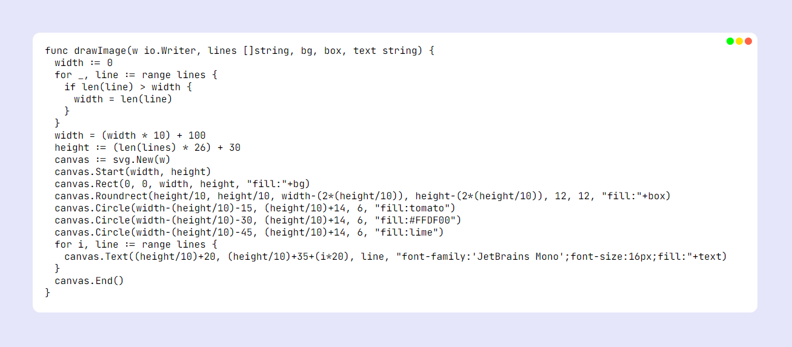

#### Engine PNG Package

bla bla bla

### 3.3.2 Testing to inform development

<details><summary>Section check list</summary>

**To do:**

- [ ] Provide annotated evidence for testing at each stage justifying the reason for the test.
- [ ] Provide annotated evidence of any remedial actions taken justifying the decision made.

</details>

<details><summary>Section notes</summary>

**Notes:**

- Final, terminal testing to prove you've met the success criteria and objectives you identified in the analysis stage

</details>

## 3.4 Evaluation

<details><summary>Section check list</summary>

**To do:**

- [ ] Provided annotated evidence of post development testing for function and robustness.
- [ ] Provided annotated evidence for usability testing. Used the test evidence to cross reference with the success criteria to evaluate the solution explain how the evidence shows that the criteria has been fully, partially or not met in each case.
- [ ] Provided comments on how any partially or unmet criteria could be addressed in further development.
- [ ] Provided evidence of the usability features justifying their success, partial success or failure as effective usability features.
- [ ] Provided comments on how any issues with partially or unmet usability features could be addressed in further development.
- [ ] Considered maintenance issues and limitations of the solution.
- [ ] Described how the program could be developed to deal with limitations of potential improvements / changes.
- [ ] There is a well developed line of reasoning which is clear and logically structured. The information presented is relevant and substantiated.

</details>
<details><summary>Section notes</summary>

**Notes:**

- As you'd expect – how well did the project go?

</details>

### 3.4.1 Testing to inform evaluation

<details><summary>Section check list</summary>

**To do:**

- [ ] Provide annotated evidence of testing the solution of robustness at the end of the development process.
- [ ] Provide annotated evidence of usability testing (user feedback).

</details>

### 3.4.2 Success of the solution

<details><summary>Section check list</summary>

**To do:**

- [ ] Use the test evidence from the development and post development process to evaluate the solution against the success criteria from the analysis.

</details>

### 3.4.3 Describe the final product

<details><summary>Section check list</summary>

**To do:**

- [ ] Provide annotated evidence of the usability features from the design, commenting on their effectiveness.

</details>

### 3.4.4 Maintenance and development

<details><summary>Section check list</summary>

**To do:**

- [ ] Discuss the maintainability of the solution.
- [ ] Discuss potential further development of the solution.

</details>

## Footnotes

1. <span id="f1"></span>A gist can be a string of code, a bash script or some other small piece of data and is an easy way to share code. GitHub (https://github.com) has a nice implementation of this in their GitHub Gist (https://gist.github.com) service. [↩](#i1)
2. <span id="f2"></span>Go, sometimes referred to as Golang, is a programming language made by Google. Go's website (https://golang.org) contains more information. [↩](#i2)
3. <span id="f2"></span>[↩](#i2)
4. <span id="f3"></span>[↩](#i3)
5. <span id="f4"></span>[↩](#i4)
6. <span id="f5"></span>[↩](#i5)
7. <span id="f7"></span>Julien Schmidt (https://github.com/julienschmidt) [↩](#i6)
8. <span id="f8"></span>`HttpRouter` (https://github.com/julienschmidt/httprouter) [↩](#i7)
9. <span id="f5"></span>[↩](#i5)
10. <span id="f5"></span>[↩](#i5)
11. <span id="f5"></span>Carbon's Website (https://carbon.now.sh/) [↩](#i5)
12. <span id="f5"></span>Carbon's Github Readme (https://github.com/carbon-app/carbon#community) [↩](#i5)
13. <span id="f5"></span>[↩](#i5)
14. <span id="f5"></span>[↩](#i5)
15. <span id="f5"></span>[↩](#i5)
16. <span id="f5"></span>[↩](#i5)
17. <span id="f5"></span>[↩](#i5)
18. <span id="f5"></span>[↩](#i5)
19. <span id="f5"></span>[↩](#i5)
20. <span id="f5"></span>[↩](#i5)
21. <span id="f5"></span>[↩](#i5)
22. <span id="f5"></span>[↩](#i5)
23. <span id="f5"></span>[↩](#i5)
24. <span id="f5"></span>[↩](#i5)
25. <span id="f25"></span> Minimum Requirements of Go (https://github.com/golang/go/wiki/MinimumRequirements) [↩](#i25)
